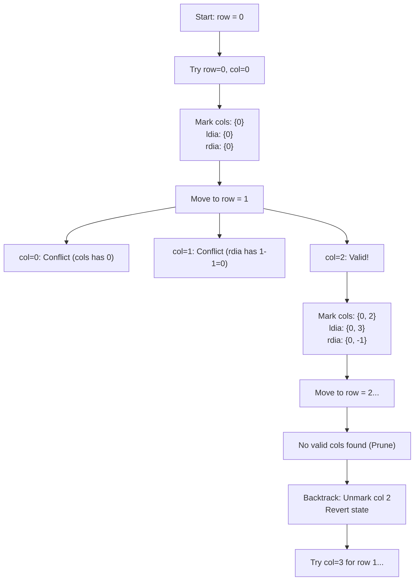

<h2><a href="https://leetcode.com/problems/n-queens">0000. N Queens</a></h2>

<p>The <strong>n-queens</strong> puzzle is the problem of placing <code>n</code> queens on an <code>n x n</code> chessboard such that no two queens attack each other.</p>

<p>Given an integer <code>n</code>, return <em>all distinct solutions to the <strong>n-queens puzzle</strong></em>. You may return the answer in <strong>any order</strong>.</p>

<p>Each solution contains a distinct board configuration of the n-queens' placement, where <code>'Q'</code> and <code>'.'</code> both indicate a queen and an empty space, respectively.</p>

<p>&nbsp;</p>
<p><strong class="example">Example 1:</strong></p>

<pre><strong>Input:</strong> n = 4
<strong>Output:</strong> [[".Q..","...Q","Q...","..Q."],["..Q.","Q...","...Q",".Q.."]]
<strong>Explanation:</strong> There exist two distinct solutions to the 4-queens puzzle as shown above
</pre>

<p><strong class="example">Example 2:</strong></p>

<pre><strong>Input:</strong> n = 1
<strong>Output:</strong> [["Q"]]
</pre>

<p>&nbsp;</p>
<p><strong>Constraints:</strong></p>

<ul>
	<li><code>1 &lt;= n &lt;= 9</code></li>
</ul>


---

# 🛍️ N-Queens | Explained

## Approach 1: Backtracking with State-Tracking HashSets
### Intuition
Imagine you are organizing a VIP gala where $N$ high-profile dignitaries (the Queens) need to be seated in an $N \times N$ banquet hall. However, none of them can be seated in the same row, column, or diagonal sightline without causing a conflict. 

Because each row can strictly contain only **one** Queen, we can eliminate row-level conflict checks entirely by placing exactly one Queen per row, moving sequentially from row `0` to row `n - 1`. 

For column and diagonal conflicts, we can take advantage of mathematical coordinate invariants:
1. **Vertical alignment:** All cells in a vertical column share identical `col` values.
2. **Anti-diagonal alignment (`/`):** Moving down and to the left increases the row index by 1 and decreases the column index by 1. Therefore, the sum `row + col` is constant along any anti-diagonal.
3. **Main diagonal alignment (`\`):** Moving down and to the right increases both row and column indices by 1. Therefore, the difference `row - col` is constant along any main diagonal.

By maintaining three sets to track occupied columns and diagonals, determining whether a position `(row, col)` is under attack takes $O(1)$ time.

---

### Algorithm Visualized
Below is the decision-making process for placing Queens row-by-row, demonstrating branching, conflict pruning, and state restoration (backtracking):



---

### Approach
1. **State Initialization:**
   - `queen`: An array where `queen[row] = col` records the Queen's position for row reconstruction.
   - `cols`: Tracks occupied column indices.
   - `ldia` (Left/Anti-Diagonal): Tracks occupied anti-diagonals via the sum `row + col`.
   - `rdia` (Right/Main Diagonal): Tracks occupied main diagonals via the difference `row - col`.
   - `result`: A collection storing all valid complete board layouts.
2. **Recursive Exploration (`backtrack`):**
   - **Base Case:** If `row == n`, all $N$ Queens are successfully placed without conflict. Call `generateboard` to build the board strings and append the configuration to `result`.
   - **Recursive Step:** Loop through columns `col = 0` to `n - 1`:
     - Calculate diagonal signatures: `row + col` and `row - col`.
     - Check if `col`, `row + col`, or `row - col` already exist in their respective sets. If any do, skip to the next column.
     - **Make Move:** Record `queen[row] = col` and add signatures to `cols`, `ldia`, and `rdia`.
     - **Recurse:** Proceed to place the Queen in the next row via `backtrack(row + 1)`.
     - **Undo Move (Backtrack):** Remove the column and diagonal signatures from `cols`, `ldia`, and `rdia` so future branches can explore these positions.

---

### Detailed Code Analysis

#### 1. Entry Point and State Setup
```java
public List<List<String>> solveNQueens(int n) {
    List<List<String>> result = new ArrayList<>();
    int[] queen = new int[n];
    Set<Integer> cols = new HashSet<>();
    Set<Integer> ldia = new HashSet<>();
    Set<Integer> rdia = new HashSet<>();
    backtrack(n, 0, queen, cols, ldia, rdia, result);
    return result;
}
```
- `result` stores lists of board representations.
- `queen` holds the chosen column for each row. The index represents the row, which prevents column-mapping ambiguity and saves space over a full 2D matrix.
- `HashSet` instances are used to achieve $O(1)$ expected lookup and insertion times for tracking collisions.

#### 2. Recursive Backtracking Function
```java
private void backtrack(int n, int row, int[] queen, Set<Integer> cols, Set<Integer> ldia, Set<Integer> rdia, List<List<String>> result) {
    if (row == n) {
        result.add(generateboard(n, queen));
        return;
    }
```
- When `row == n`, we have traversed rows `0` through `n - 1` without encountering an invalid placement. This marks a terminal leaf in the recursion tree representing a valid solution.

#### 3. Conflict Checking and Pruning
```java
    for (int col = 0; col < n; col++) {
        if (cols.contains(col) || ldia.contains(row + col) || rdia.contains(row - col)) {
            continue;
        }
```
- Iterates through all possible columns in the current `row`.
- `cols.contains(col)` guarantees no two Queens share a column.
- `ldia.contains(row + col)` captures the bottom-left to top-right diagonal line.
- `rdia.contains(row - col)` captures the top-left to bottom-right diagonal line.
- If any condition is met, the branch is invalid and pruned immediately via `continue`.

#### 4. Applying and Reverting Decisions
```java
        queen[row] = col;
        cols.add(col);
        ldia.add(row + col);
        rdia.add(row - col);

        backtrack(n, row + 1, queen, cols, ldia, rdia, result);

        cols.remove(col);
        ldia.remove(row + col);
        rdia.remove(row - col);
    }
}
```
- **Place Queen:** Record column selection in `queen[row]` and register the collision signatures in the sets.
- **Recurse:** Step forward into `row + 1`.
- **Backtrack:** When the recursive branch finishes (either reaching a solution or exhausting options), cleanly remove `col`, `row + col`, and `row - col` from the sets. `queen[row]` does not require explicit clearing because subsequent iterations will overwrite it.

#### 5. Board Generation
```java
private List<String> generateboard(int n, int[] queen) {
    List<String> board = new ArrayList<>();
    for (int i = 0; i < n; i++) {
        char[] row = new char[n];
        Arrays.fill(row, '.');
        row[queen[i]] = 'Q';
        board.add(new String(row));
    }
    return board;
}
```
- Converts the compact 1D representation (`queen` array) into the expected output format of string rows.
- Pre-fills a `char[]` buffer with `'.'` characters and sets only the indexed position `queen[i]` to `'Q'`.

---

### Code
```java
class Solution {
    public List<List<String>> solveNQueens(int n) {
        List<List<String>> result = new ArrayList<>();
        int[] queen = new int[n];
        Set<Integer> cols = new HashSet<>();
        Set<Integer> ldia = new HashSet<>();
        Set<Integer> rdia = new HashSet<>();
        backtrack(n, 0, queen, cols, ldia, rdia, result);
        return result;
    }

    private void backtrack(int n, int row, int[] queen, Set<Integer> cols, Set<Integer> ldia, Set<Integer> rdia, List<List<String>> result) {
        if (row == n) {
            result.add(generateboard(n, queen));
            return;
        }
        for (int col = 0; col < n; col++) {
            if (cols.contains(col) || ldia.contains(row + col) || rdia.contains(row - col)) {
                continue;
            }
            queen[row] = col;
            cols.add(col);
            ldia.add(row + col);
            rdia.add(row - col);

            backtrack(n, row + 1, queen, cols, ldia, rdia, result);

            cols.remove(col);
            ldia.remove(row + col);
            rdia.remove(row - col);
        }
    }

    private List<String> generateboard(int n, int[] queen) {
        List<String> board = new ArrayList<>();
        for (int i = 0; i < n; i++) {
            char[] row = new char[n];
            Arrays.fill(row, '.');
            row[queen[i]] = 'Q';
            board.add(new String(row));
        }
        return board;
    }
}
```

---

### Complexity
- **Time Complexity:** $\mathcal{O}(N!)$
  - In the first row, there are $N$ placement possibilities.
  - In the second row, at most $N - 1$ columns are valid (due to column constraints), and diagonal conflicts reduce options further.
  - In general, the upper bound is bounded by $N!$.
  - When a valid configuration is found, converting the board takes $\mathcal{O}(N^2)$ time. If $S$ is the number of valid solutions, the total time complexity is $\mathcal{O}(N! + S \cdot N^2)$.
- **Space Complexity:** $\mathcal{O}(N)$ auxiliary space (excluding the output list)
  - The recursion call stack reaches a maximum depth of $N$.
  - The `queen` array holds $N$ entries.
  - The sets `cols`, `ldia`, and `rdia` each contain at most $N$ elements at any point during traversal.
  - Total output space is $\mathcal{O}(S \cdot N^2)$ to store all $S$ complete board representations.

---

## 🕵️‍♂️ Follow-up Questions (Optional)

1. **How can you optimize the lookup speed and memory overhead of the `HashSet`s?**
   - **Answer:** Replace the three `HashSet<Integer>` objects with integer bitmasks. Since $N \le 9$ on standard platforms (and easily fits within a 32-bit integer for $N \le 31$), three bitmask integers (`cols`, `ldia`, `rdia`) can track occupied lines using bitwise operations (`|`, `&`, `~`). This eliminates heap allocations, auto-boxing (`int` $\to$ `Integer`), and hash calculations, speeding up runtime significantly.

2. **How does the approach change if the problem only asks for the total number of solutions (N-Queens II)?**
   - **Answer:** If we only need the count rather than the board layouts, we can remove the `queen` array and the `generateboard` method entirely. The base case simply increments a counter (`count++`) and returns, saving both memory allocations and the $\mathcal{O}(N^2)$ string reconstruction overhead.