<h2><a href="https://leetcode.com/problems/unique-3-digit-even-numbers">0000. Unique 3 Digit Even Numbers</a></h2>

<p>You are given an array of digits called <code>digits</code>. Your task is to determine the number of <strong>distinct</strong> three-digit even numbers that can be formed using these digits.</p>

<p><strong>Note</strong>: Each <em>copy</em> of a digit can only be used <strong>once per number</strong>, and there may <strong>not</strong> be leading zeros.</p>

<p>&nbsp;</p>
<p><strong class="example">Example 1:</strong></p>

<div class="example-block">
<p><strong>Input:</strong> <span class="example-io">digits = [1,2,3,4]</span></p>

<p><strong>Output:</strong> <span class="example-io">12</span></p>

<p><strong>Explanation:</strong> The 12 distinct 3-digit even numbers that can be formed are 124, 132, 134, 142, 214, 234, 312, 314, 324, 342, 412, and 432. Note that 222 cannot be formed because there is only 1 copy of the digit 2.</p>
</div>

<p><strong class="example">Example 2:</strong></p>

<div class="example-block">
<p><strong>Input:</strong> <span class="example-io">digits = [0,2,2]</span></p>

<p><strong>Output:</strong> <span class="example-io">2</span></p>

<p><strong>Explanation:</strong> The only 3-digit even numbers that can be formed are 202 and 220. Note that the digit 2 can be used twice because it appears twice in the array.</p>
</div>

<p><strong class="example">Example 3:</strong></p>

<div class="example-block">
<p><strong>Input:</strong> <span class="example-io">digits = [6,6,6]</span></p>

<p><strong>Output:</strong> <span class="example-io">1</span></p>

<p><strong>Explanation:</strong> Only 666 can be formed.</p>
</div>

<p><strong class="example">Example 4:</strong></p>

<div class="example-block">
<p><strong>Input:</strong> <span class="example-io">digits = [1,3,5]</span></p>

<p><strong>Output:</strong> <span class="example-io">0</span></p>

<p><strong>Explanation:</strong> No even 3-digit numbers can be formed.</p>
</div>

<p>&nbsp;</p>
<p><strong>Constraints:</strong></p>

<ul>
	<li><code>3 &lt;= digits.length &lt;= 10</code></li>
	<li><code>0 &lt;= digits[i] &lt;= 9</code></li>
</ul>


---

# 🛍️ Unique-3-Digit-Even-Numbers | Explained

## Approach 1: Frequency Array with Fixed Search-Space Enumeration

### Intuition
Instead of generating permutations from the input array `digits` (which requires handling duplicates and sorting a potentially large number of candidates), we flip the problem on its head: **iterate through all possible valid 3-digit even numbers and verify if they can be formed using our available inventory of digits.**

Think of it like shopping with a pantry inventory. If you want to know which recipes you can make, you don't randomly combine ingredients from your pantry to see what dishes you accidentally invent. Instead, you look at a fixed menu of all known dishes (here, 3-digit even numbers), check the recipe card for the required ingredients (the digits $i$, $j$, and $k$), and see if your pantry has enough of each item.

A valid 3-digit even number must satisfy:
1. **Hundreds digit ($i$):** Cannot be `0` (must be between `1` and `9`).
2. **Tens digit ($j$):** Can be any digit from `0` to `9`.
3. **Units digit ($k$):** Must be even (`0`, `2`, `4`, `6`, or `8`).

There are only $9 \times 10 \times 5 = 450$ such numbers. Verifying whether 450 fixed numbers can be constructed from a digit frequency table runs in constant time relative to the number search space.

---

### Algorithm Visualized

```mermaid
flowchart TD
    Start([Start]) --> BuildFreq[Build Frequency Array f of Digits]
    BuildFreq --> LoopI[Loop i from 1 to 9<br>Hundreds Digit]
    LoopI --> LoopJ[Loop j from 0 to 9<br>Tens Digit]
    LoopJ --> LoopK[Loop k from 0 to 8 step 2<br>Units Digit]
    
    LoopK --> Consume[Decrement: f&#91;i&#93;--, f&#91;j&#93;--, f&#91;k&#93;--]
    Consume --> Check{f&#91;i&#93; >= 0 AND<br>f&#91;j&#93; >= 0 AND<br>f&#91;k&#93; >= 0?}
    
    Check -- Yes --> IncRes[res++]
    Check -- No --> Restore[Restore: f&#91;i&#93;++, f&#91;j&#93;++, f&#91;k&#93;++]
    IncRes --> Restore
    
    Restore --> NextK{More k?}
    NextK -- Yes --> LoopK
    NextK -- No --> NextJ{More j?}
    NextJ -- Yes --> LoopJ
    NextJ -- No --> NextI{More i?}
    NextI -- Yes --> LoopI
    NextI -- No --> Done([Return res])
```



---

### Approach
1. **Count Frequencies:** Build a frequency table `f` of size `10` to record the count of each digit in `digits`.
2. **Exhaust Search Space:**
   - Iterate $i$ from `1` to `9` (valid non-zero leading digits).
   - Iterate $j$ from `0` to `9` (valid middle digits).
   - Iterate $k$ from `0` to `8` in steps of `2` (valid even trailing digits).
3. **Validate Availability via Backtracking:**
   - Temporarily borrow/consume digits $i$, $j$, and $k$ by decrementing `f[i]--`, `f[j]--`, and `f[k]--`.
   - Check if all three counts remain non-negative (`>= 0`). This naturally handles repetition: if $i = j = k = 2$, `f[2]` will be decremented three times, correctly requiring at least three `2`s in the original array.
   - If valid, increment the counter `res`.
   - Restore the counts by incrementing `f[i]++`, `f[j]++`, and `f[k]++` before evaluating the next candidate tuple.
4. **Return Result:** Return `res`.

---

### Detailed Code Analysis

```java
int[] f = new int[10];
int res = 0;
for (int d : digits) f[d]++;
```
- A fixed-size array `f` of size 10 serves as a frequency bucket for digits `0` through `9`.
- Iterating through `digits` populates the frequency of each digit in $O(N)$ time.
- `res` is initialized to track the number of valid unique 3-digit even numbers.

```java
for (int i = 1; i < 10; i++) {
    for (int j = 0; j < 10; j++) {
        for (int k = 0; k < 9; k += 2) {
```
- **Line 6 (`i = 1; i < 10`):** The hundreds place cannot have a leading zero, bounding $i \in [1, 9]$ (9 possibilities).
- **Line 7 (`j = 0; j < 10`):** The tens place has no restrictions, bounding $j \in [0, 9]$ (10 possibilities).
- **Line 8 (`k = 0; k < 9; k += 2`):** The units place must be even. Iterating with `k += 2` up to `k < 9` tests `k` $\in \{0, 2, 4, 6, 8\}$ (5 possibilities).
- The total combinations checked are strictly $9 \times 10 \times 5 = 450$ iterations.

```java
f[i]--; f[j]--; f[k]--;
if (f[i] >= 0 && f[j] >= 0 && f[k] >= 0) res++;
f[i]++; f[j]++; f[k]++;
```
- **Simulated Consumption:** Decrementing `f[i]`, `f[j]`, and `f[k]` simulates using these digits to form the number. Even if $i$, $j$, and $k$ share the same value (e.g., forming `222`), subtracting consecutively reduces that specific bucket by up to 3.
- **Validity Check:** If after decrements, `f[i] >= 0 && f[j] >= 0 && f[k] >= 0`, we have sufficient count of all required digits in `digits`. We increment `res`.
- **Restoration (Backtracking):** Restoring the values (`f[i]++`, `f[j]++`, `f[k]++`) ensures the frequency array remains intact for the next candidate tuple.

```java
return res;
```
- Returns the total count of valid unique 3-digit even numbers.

---

### Code

```java
class Solution {
    public int totalNumbers(int[] digits) {
        int[] f = new int[10];
        int res = 0;
        for (int d : digits) f[d]++;
        for (int i = 1; i < 10; i++) {
            for (int j = 0; j < 10; j++) {
                for (int k = 0; k < 9; k += 2) {
                    f[i]--; f[j]--; f[k]--;
                    if (f[i] >= 0 && f[j] >= 0 && f[k] >= 0) res++;
                    f[i]++; f[j]++; f[k]++;
                }
            }
        }
        return res;
    }
}
```

---

### Complexity

- **Time Complexity:** $\mathcal{O}(N)$
  - Constructing the frequency array takes $\mathcal{O}(N)$ where $N$ is `digits.length`.
  - The nested loops execute exactly $9 \times 10 \times 5 = 450$ times. Each iteration performs $\mathcal{O}(1)$ arithmetic and comparison operations.
  - Total Time: $\mathcal{O}(N + 450) \equiv \mathcal{O}(N)$.

- **Space Complexity:** $\mathcal{O}(1)$
  - The frequency table `f` has a fixed size of 10, independent of input size $N$.
  - Auxiliary space is strictly $\mathcal{O}(1)$.

---

## 🕵️‍♂️ Follow-up Questions

1. **How would you modify this code if you needed to return the actual unique numbers in ascending order instead of just the count?**
   - Because the three loops iterate $i$ (hundreds), $j$ (tens), and $k$ (units) in strictly ascending order, any valid number formed as `i * 100 + j * 10 + k` is generated in naturally sorted order. We can collect them into a dynamic list (or pre-count to allocate an `int[]`) and return the array directly without needing a separate sorting step.

2. **When does this candidate-checking approach become worse than generating permutations from the input array?**
   - This approach is optimal when the candidate space is small (here, only 450 numbers). If the problem asked for valid $K$-digit numbers where $K$ is large (e.g., $K = 10$), the search space becomes $9 \times 10^{8} \times 5 \approx 4.5 \times 10^9$ candidates, which would TLE. In that scenario, generating valid permutations directly from the input array (constrained by available digits and pruned early) would be significantly faster.