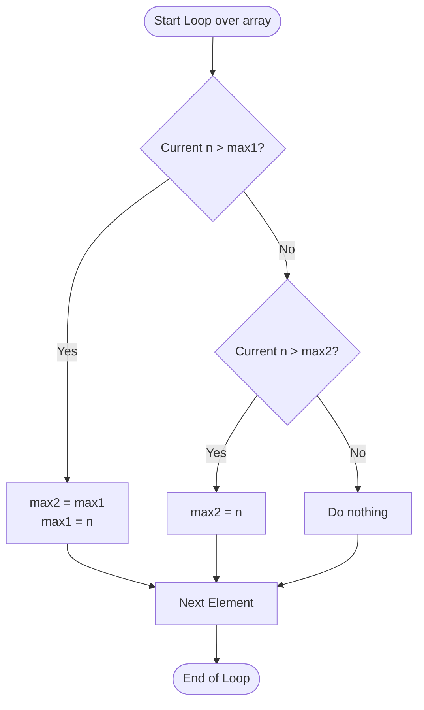

<h2><a href="https://leetcode.com/problems/maximum-product-of-two-elements-in-an-array">1464. Maximum Product of Two Elements in an Array</a></h2>

Given the array of integers <code>nums</code>, you will choose two different indices <code>i</code> and <code>j</code> of that array. <em>Return the maximum value of</em> <code>(nums[i]-1)*(nums[j]-1)</code>.
<p>&nbsp;</p>
<p><strong class="example">Example 1:</strong></p>

<pre><strong>Input:</strong> nums = [3,4,5,2]
<strong>Output:</strong> 12 
<strong>Explanation:</strong> If you choose the indices i=1 and j=2 (indexed from 0), you will get the maximum value, that is, (nums[1]-1)*(nums[2]-1) = (4-1)*(5-1) = 3*4 = 12. 
</pre>

<p><strong class="example">Example 2:</strong></p>

<pre><strong>Input:</strong> nums = [1,5,4,5]
<strong>Output:</strong> 16
<strong>Explanation:</strong> Choosing the indices i=1 and j=3 (indexed from 0), you will get the maximum value of (5-1)*(5-1) = 16.
</pre>

<p><strong class="example">Example 3:</strong></p>

<pre><strong>Input:</strong> nums = [3,7]
<strong>Output:</strong> 12
</pre>

<p>&nbsp;</p>
<p><strong>Constraints:</strong></p>

<ul>
	<li><code>2 &lt;= nums.length &lt;= 500</code></li>
	<li><code>1 &lt;= nums[i] &lt;= 10^3</code></li>
</ul>


---

# 🛍️ Maximum-Product-of-Two-Elements-in-an-Array | Explained

## Approach 1: Single-Pass Linear Search (Tracking Top Two Maximums)

### Intuition
To maximize the value of $(nums[i] - 1) \times (nums[j] - 1)$, where $i \neq j$, we need to select the two largest numbers in the array. Since all elements in the array are positive integers (per constraints, $1 \le nums[i] \le 10^3$), maximizing $nums[i]$ and $nums[j]$ directly maximizes the resulting product.

Think of this like a competition to award gold and silver medals. As you inspect contestants one by one:
- If a new contestant is better than the current Gold medalist, the previous Gold medalist is demoted to Silver, and the new contestant takes Gold.
- If a new contestant isn't better than Gold but beats the current Silver medalist, they take Silver.

By keeping track of the top two highest values in a single sweep, we avoid sorting the entire array, achieving optimal time efficiency.

### Algorithm Visualized


### Approach
1. Initialize two scalar variables, `max1` and `max2`, to `0`. These will hold the largest and second-largest values encountered so far.
2. Iterate through each element `n` in the input array `nums`:
   - If `n` is strictly greater than `max1`, shift `max1` down to `max2` (the old largest is now second largest) and update `max1` to `n`.
   - Else if `n` is greater than `max2`, update `max2` to `n`.
3. After the loop completes, calculate and return `(max1 - 1) * (max2 - 1)`.

### Detailed Code Analysis

- **Lines 3–4:** `int max1=0; int max2=0;`  
  We initialize both variables to `0`. Given problem constraints ($1 \le nums[i] \le 10^3$), `0` serves as a safe lower bound since any valid array entry will be $\ge 1$.

- **Line 5:** `for(int n:nums)`  
  An enhanced `for` loop (for-each) iterates through every element `n` in the array `nums` sequentially from left to right.

- **Lines 6–8:** `if(n>max1) { max2=max1; max1=n; }`  
  This handles the case where `n` exceeds the largest value seen so far. Crucially, before overwriting `max1` with `n`, we must preserve the previous maximum by reassigning `max2 = max1`.

- **Lines 9–11:** `}else if(n>max2){ max2=n; }`  
  If `n` was not strictly greater than `max1`, it might still be greater than `max2` (or equal to `max1` in case of duplicates). In this scenario, we update `max2` directly.

- **Line 14:** `return (max1-1)*(max2-1);`  
  Calculates the required output formula using the two largest extracted integers and returns the result.

### Code
```java
class Solution {
    public int maxProduct(int[] nums) {
        int max1 = 0;
        int max2 = 0;
        for (int n : nums) {
            if (n > max1) {
                max2 = max1;
                max1 = n;
            } else if (n > max2) {
                max2 = n;
            }
        }
        
        return (max1 - 1) * (max2 - 1); 
    }
}
```

### Complexity
- **Time:** $\mathcal{O}(N)$ — We traverse the input array of size $N$ exactly once. Each comparison and variable update takes $\mathcal{O}(1)$ time.
- **Space:** $\mathcal{O}(1)$ — We only allocate two primitive integer variables (`max1` and `max2`), utilizing constant auxiliary space.

---

## 🕵️‍♂️ Follow-up Questions (Optional)

**1. What if the array contains negative numbers?**
- *Answer:* If negative numbers were allowed, the maximum product could potentially come from multiplying two large negative numbers (since negative $\times$ negative = positive). We would need to track both the two maximum values (`max1`, `max2`) and the two minimum values (`min1`, `min2`) in a single pass, then compare `(max1 - 1) * (max2 - 1)` with `(min1 - 1) * (min2 - 1)`.

**2. How does this compare to a sorting-based solution?**
- *Answer:* Sorting the array takes $\mathcal{O}(N \log N)$ time and potentially $\mathcal{O}(N)$ or $\mathcal{O}(\log N)$ extra space depending on the sorting algorithm implementation. Tracking the top two elements manually reduces the time complexity to optimal linear time $\mathcal{O}(N)$ and space to $\mathcal{O}(1)$.