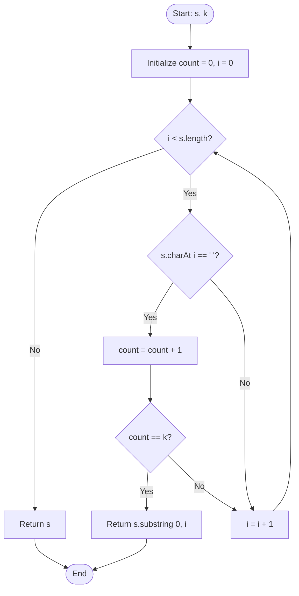

<h2><a href="https://leetcode.com/problems/truncate-sentence">1816. Truncate Sentence</a></h2>

<p>A <strong>sentence</strong> is a list of words that are separated by a single space with no leading or trailing spaces. Each of the words consists of <strong>only</strong> uppercase and lowercase English letters (no punctuation).</p>

<ul>
	<li>For example, <code>"Hello World"</code>, <code>"HELLO"</code>, and <code>"hello world hello world"</code> are all sentences.</li>
</ul>

<p>You are given a sentence <code>s</code>​​​​​​ and an integer <code>k</code>​​​​​​. You want to <strong>truncate</strong> <code>s</code>​​​​​​ such that it contains only the <strong>first</strong> <code>k</code>​​​​​​ words. Return <code>s</code>​​​​<em>​​ after <strong>truncating</strong> it.</em></p>

<p>&nbsp;</p>
<p><strong class="example">Example 1:</strong></p>

<pre><strong>Input:</strong> s = "Hello how are you Contestant", k = 4
<strong>Output:</strong> "Hello how are you"
<strong>Explanation:</strong>
The words in s are ["Hello", "how", "are", "you", "Contestant"].
The first 4 words are ["Hello", "how", "are", "you"].
Hence, you should return "Hello how are you".
</pre>

<p><strong class="example">Example 2:</strong></p>

<pre><strong>Input:</strong> s = "What is the solution to this problem", k = 4
<strong>Output:</strong> "What is the solution"
<strong>Explanation:</strong>
The words in s are ["What", "is", "the", "solution", "to", "this", "problem"].
The first 4 words are ["What", "is", "the", "solution"].
Hence, you should return "What is the solution".</pre>

<p><strong class="example">Example 3:</strong></p>

<pre><strong>Input:</strong> s = "chopper is not a tanuki", k = 5
<strong>Output:</strong> "chopper is not a tanuki"
</pre>

<p>&nbsp;</p>
<p><strong>Constraints:</strong></p>

<ul>
	<li><code>1 &lt;= s.length &lt;= 500</code></li>
	<li><code>k</code> is in the range <code>[1, the number of words in s]</code>.</li>
	<li><code>s</code> consist of only lowercase and uppercase English letters and spaces.</li>
	<li>The words in <code>s</code> are separated by a single space.</li>
	<li>There are no leading or trailing spaces.</li>
</ul>


---

# 🛍️ Truncate-Sentence | Explained

## Approach 1: Space-Counting Single-Pass Scan

### Intuition
Think of a sentence as a passenger train where each train car is a word and the couplers connecting them are spaces. If you are asked to keep only the first $k$ cars, you don't need to detach every single car in the entire train individually. Instead, you simply walk along the train from the front, count the couplers (spaces) you pass, and slice the train right at the $k$-th coupler. 

Because words in this problem are separated by a single space, encountering $k$ spaces means you have just completed the $k$-th word. Everything before that $k$-th space constitutes the truncated sentence.

### Algorithm Visualized



### Approach
1. **Track Word Separators**: Maintain a running counter `count` to record the number of spaces encountered.
2. **Scan the String**: Traverse the string `s` from left to right using a pointer `i`.
3. **Detect Word Boundaries**:
   - Each time `s.charAt(i)` is a space character (`' '`), increment `count`.
   - Immediately check if `count == k`. If it is, the space at index `i` is the boundary separating the $k$-th word from the $(k+1)$-th word.
4. **Early Termination**:
   - Return the substring from index `0` up to `i` (exclusive of the space at index `i`).
5. **Fallback Edge Case**:
   - If the loop finishes without reaching `k` spaces, the sentence contains fewer than or exactly $k$ words. In that case, return the original string `s`.

### Detailed Code Analysis

```java
class Solution {
    public String truncateSentence(String s, int k) {
        int count = 0;
```
- **Line 3:** Initializes a primitive integer `count` to `0`. This keeps track of the spaces seen so far without allocating heap memory.

```java
        for (int i = 0; i < s.length(); i++) {
            if (s.charAt(i) == ' ') {
                count++;
            }
```
- **Line 4:** Standard `for` loop that iterates over each character index `i` from `0` to `s.length() - 1`. Using `s.charAt(i)` avoids allocating a new `char[]` array (which `s.toCharArray()` would do).
- **Lines 5–7:** Checks if the character at index `i` is a space `' '`. If true, `count` is incremented. Each space indicates that the word preceding it has ended.

```java
            if (count == k) {
                return s.substring(0, i);
            }
        }
```
- **Lines 8–10:** Immediately checks if the space count has reached `k`. 
- When `count == k`, the current character `s.charAt(i)` is the space right after the $k$-th word. 
- Calling `s.substring(0, i)` extracts all characters from index `0` up to index `i - 1`, neatly cutting off the rest of the string and omitting the space at index `i`.

```java
        return s;
    }
}
```
- **Line 11:** If the loop terminates without returning (for instance, when $k$ equals the total number of words in the sentence), the entire string `s` is returned as-is.

### Code
```java
class Solution {
    public String truncateSentence(String s, int k) {
        int count = 0;
        for (int i = 0; i < s.length(); i++) {
            if (s.charAt(i) == ' ') {
                count++;
            }
            if (count == k) {
                return s.substring(0, i);
            }
        }
        return s;
    }
}
```

### Complexity
- **Time Complexity:** $\mathcal{O}(N)$
  - In the worst case (where $k$ equals the total number of words), the loop runs $N$ times, where $N$ is the length of string `s`.
  - Creating the substring `s.substring(0, i)` takes $\mathcal{O}(M)$ time, where $M \le N$ is the length of the truncated string.
  - Overall time complexity is strictly linear: $\mathcal{O}(N)$.
- **Space Complexity:** $\mathcal{O}(1)$ auxiliary space
  - The traversal relies only on a couple of primitive variables (`count` and `i`), consuming $\mathcal{O}(1)$ additional memory.
  - Note: The returned `String` requires $\mathcal{O}(M)$ space for the output, but auxiliary working memory remains $\mathcal{O}(1)$.

---

## 🕵️‍♂️ Follow-up Questions

1. **Why is this approach preferred over `s.split(" ")`?**
   - Using `s.split(" ")` creates an array of strings containing every word in the sentence, allocating significant memory on the heap and running through the entire string even if $k = 1$. The single-pass counting approach halts as soon as the $k$-th word is reached and allocates only the final substring.

2. **How would you adapt this solution if the sentence contained multiple consecutive spaces or leading/trailing spaces?**
   - A single-character equality check (`s.charAt(i) == ' '`) would miscount consecutive spaces as multiple word delimiters. You would need a two-pointer or flag-based approach (e.g., `inWord` boolean state) to detect transitions from a non-space character to a space character.