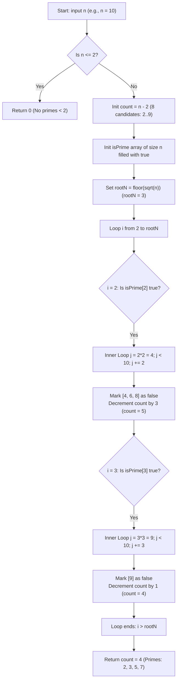

<h2><a href="https://leetcode.com/problems/count-primes">204. Count Primes</a></h2>

<p>Given an integer <code>n</code>, return <em>the number of prime numbers that are strictly less than</em> <code>n</code>.</p>

<p>&nbsp;</p>
<p><strong class="example">Example 1:</strong></p>

<pre><strong>Input:</strong> n = 10
<strong>Output:</strong> 4
<strong>Explanation:</strong> There are 4 prime numbers less than 10, they are 2, 3, 5, 7.
</pre>

<p><strong class="example">Example 2:</strong></p>

<pre><strong>Input:</strong> n = 0
<strong>Output:</strong> 0
</pre>

<p><strong class="example">Example 3:</strong></p>

<pre><strong>Input:</strong> n = 1
<strong>Output:</strong> 0
</pre>

<p>&nbsp;</p>
<p><strong>Constraints:</strong></p>

<ul>
	<li><code>0 &lt;= n &lt;= 5 * 10<sup>6</sup></code></li>
</ul>


---

# 🛍️ Count-Primes | Explained

## Approach 1: Sieve of Eratosthenes with Square Root & $i^2$ Optimizations

### Intuition
Imagine you have a grid of numbers from $2$ to $n-1$. To find all prime numbers, instead of testing each number individually for divisibility (which is slow), you use an elimination process. You start at the first prime, $2$, and cross out all of its multiples ($4, 6, 8, \dots$) because none of them can ever be prime. Then you move to the next un-crossed number, $3$, and cross out all of its multiples ($6, 9, 12, \dots$). 

This elimination strategy is the classical **Sieve of Eratosthenes**. 

Two crucial insights optimize this process:
1. **Square Root Bound (`i <= rootN`)**: If a number $m < n$ is composite, it must have a prime factor less than or equal to $\sqrt{n}$. Therefore, any composite number $< n$ will have already been crossed off by the time our outer loop reaches $\sqrt{n}$.
2. **Inner Loop Optimization (`j = i * i`)**: When crossing out multiples of a prime $i$, any smaller multiple $k \cdot i$ (where $k < i$) has already been crossed out by a smaller prime factor of $k$. Thus, we can safely start crossing out multiples at $i^2$.

### Algorithm Visualized



### Approach
1. **Base Case Check**: If $n \le 2$, return `0` immediately because there are no prime numbers strictly less than $2$.
2. **State Tracking Initialization**:
   - Calculate candidate count as `n - 2` (assuming every number from $2$ to $n-1$ is prime initially).
   - Create a boolean array `isPrime` of size $n$ filled with `true`.
   - Calculate `rootN = Math.floor(Math.sqrt(n))` as the stopping point for prime discovery.
3. **Sieve Outer Loop**: Iterate $i$ from $2$ up to `rootN`.
   - If `isPrime[i]` is `true`, $i$ is prime.
4. **Sieve Inner Loop**: Iterate $j$ starting at $i \cdot i$, incrementing by $i$ up to $n - 1$.
   - Check if `isPrime[j]` is still `true`.
   - If so, mark `isPrime[j] = false` and decrement `count`.
5. **Return Result**: Return the accumulated `count`.

### Detailed Code Analysis

Let's break down the exact JavaScript implementation block-by-block:

```javascript
if (n <= 2) return 0;
```
The problem asks for the number of prime numbers **strictly less than** $n$. Since $2$ is the smallest prime number, any $n \le 2$ yields 0 prime numbers.

```javascript
let count = n - 2; // Initially we have n-2 primes as 1 and n are excluded
```
Instead of iterating through the boolean array at the end to count `true` values, we maintain a running tally. The total numbers in the range $[2, n-1]$ is $(n - 1) - 2 + 1 = n - 2$. We assume all of them are prime at the start and decrement `count` whenever we discover a composite number.

```javascript
const rootN = Math.floor(Math.sqrt(n));
const isPrime = new Array(n).fill(true);
```
- `rootN` stores $\lfloor\sqrt{n}\rfloor$. We do not need to check prime multiples for any $i > \sqrt{n}$ because their square $i^2$ would be $\ge n$, meaning all their non-prime multiples $< n$ have already been processed by smaller prime factors.
- `isPrime` is instantiated as an array of length $n$ initialized to `true`. Index $k$ represents whether integer $k$ is prime.

```javascript
for (let i = 2; i <= rootN; i++) {
    if (isPrime[i]) {
        for (let j = i * i; j < n; j += i) {
            if (isPrime[j]) {
                isPrime[j] = false;
                count--;
            }
        }
    }
}
```
- **Outer Loop (`i <= rootN`)**: Scans potential prime factors up to $\sqrt{n}$.
- **Guard Clause (`if (isPrime[i])`)**: If `isPrime[i]` is `false`, it means $i$ is composite, so its multiples have already been marked by its prime factors.
- **Inner Loop (`j = i * i; j < n; j += i`)**: Marks multiples of $i$. Starting at $i * i$ avoids redundant operations. For instance, when $i = 5$, $2 \cdot 5$, $3 \cdot 5$, and $4 \cdot 5$ were already marked when $i = 2, 3,$ and $2$ respectively.
- **Duplicate Prevention (`if (isPrime[j])`)**: A composite number like $12$ is a multiple of both $2$ and $3$. The inner check ensures that `count` is decremented **only once** when $12$ transitions from `true` to `false` for the first time.

```javascript
return count;
```
Returns the remaining count of prime numbers $< n$.

### Code

```javascript
/**
 * @param {number} n
 * @return {number}
 */
var countPrimes = function(n) {
    if (n <= 2) return 0;
    
    let count = n - 2; // Initially we have n-2 primes as 1 and n are excluded
    const rootN = Math.floor(Math.sqrt(n));
    const isPrime = new Array(n).fill(true);
    
    for (let i = 2; i <= rootN; i++) {
        if (isPrime[i]) {
            for (let j = i * i; j < n; j += i) {
                if (isPrime[j]) {
                    isPrime[j] = false;
                    count--;
                }
            }
        }
    }
    
    return count;
};
```

### Complexity

- **Time Complexity:** $\mathcal{O}(n \log \log n)$
  > **Clarification on code comment:** The inline comment suggests that stopping at $\sqrt{n}$ reduces the asymptotic complexity to $\mathcal{O}(\sqrt{n} \log \log n)$. This is a common misconception. 
  > 
  > Mathematically, by **Mertens' Second Theorem**, the sum of inverses of primes up to $x$ is $\sum_{p \le x} \frac{1}{p} = \ln \ln x + M + \mathcal{O}(1)$.
  > 
  > Summing operations for inner loops up to $\sqrt{n}$:
  > $$\sum_{p \le \sqrt{n}} \frac{n}{p} = n \sum_{p \le \sqrt{n}} \frac{1}{p} = n \left( \ln \ln \sqrt{n} + \mathcal{O}(1) \right) = n \left( \ln \left( \frac{1}{2} \ln n \right) + \mathcal{O}(1) \right) = n (\ln \ln n - \ln 2 + \mathcal{O}(1)) = \mathcal{O}(n \log \log n)$$
  >
  > While the stopping condition $\sqrt{n}$ significantly cuts execution time by a constant factor (roughly $2\times$ to $3\times$ faster in practice), the asymptotic upper bound remains $\mathcal{O}(n \log \log n)$.

- **Space Complexity:** $\mathcal{O}(n)$
  - Requires a boolean array `isPrime` of size $n$ to store the primality status of each integer from $0$ to $n-1$.

---

## 🕵️‍♂️ Follow-up Questions

### 1. How can we optimize the auxiliary space complexity of this solution?
**Answer:** 
- **Bit Manipulation / Bitsets**: Instead of using JavaScript's standard array (where each element takes at least 1 byte or 8 bytes depending on engine representation), we can use a `Uint8Array` or bitwise operations to store 8 numbers per byte. This reduces space by a factor of 8 ($n/8$ bytes).
- **Segmented Sieve**: For extremely large values of $n$ where $n$ exceeds available RAM, we can use a **Segmented Sieve**. We only find primes up to $\sqrt{n}$ first, and then divide the range $[1, n]$ into blocks/segments of size $S \approx \sqrt{n}$. We process one segment at a time in memory, lowering space complexity to $\mathcal{O}(\sqrt{n})$.

### 2. Why do we start the inner loop at $j = i \times i$ instead of $j = 2 \times i$?
**Answer:**
For any prime $i$, all multiples $k \cdot i$ where $k < i$ have already been marked as false by a smaller prime factor of $k$. 
For example, for $i = 5$:
- $2 \times 5 = 10$ (already marked when $i = 2$)
- $3 \times 5 = 15$ (already marked when $i = 3$)
- $4 \times 5 = 20$ (already marked when $i = 2$)

The first multiple of $5$ that has **not** been marked by any smaller prime is $5 \times 5 = 25$. Starting at $i^2$ eliminates redundant writes and checks.