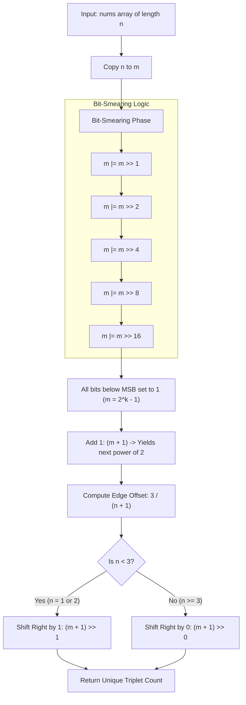

<h2><a href="https://leetcode.com/problems/number-of-unique-xor-triplets-i">3513. Number of Unique XOR Triplets I</a></h2>

<p>You are given an integer array <code>nums</code> of length <code>n</code>, where <code>nums</code> is a <strong><span data-keyword="permutation" class=" cursor-pointer relative text-dark-blue-s text-sm"><button type="button" aria-haspopup="dialog" aria-expanded="false" aria-controls="radix-_r_1l_" data-state="closed" class="">permutation</button></span></strong> of the numbers in the range <code>[1, n]</code>.</p>

<p>A <strong>XOR triplet</strong> is defined as the XOR of three elements <code>nums[i] XOR nums[j] XOR nums[k]</code> where <code>i &lt;= j &lt;= k</code>.</p>

<p>Return the number of <strong>unique</strong> XOR triplet values from all possible triplets <code>(i, j, k)</code>.</p>

<p>&nbsp;</p>
<p><strong class="example">Example 1:</strong></p>

<div class="example-block">
<p><strong>Input:</strong> <span class="example-io">nums = [1,2]</span></p>

<p><strong>Output:</strong> <span class="example-io">2</span></p>

<p><strong>Explanation:</strong></p>

<p>The possible XOR triplet values are:</p>

<ul>
	<li><code>(0, 0, 0) → 1 XOR 1 XOR 1 = 1</code></li>
	<li><code>(0, 0, 1) → 1 XOR 1 XOR 2 = 2</code></li>
	<li><code>(0, 1, 1) → 1 XOR 2 XOR 2 = 1</code></li>
	<li><code>(1, 1, 1) → 2 XOR 2 XOR 2 = 2</code></li>
</ul>

<p>The unique XOR values are <code>{1, 2}</code>, so the output is 2.</p>
</div>

<p><strong class="example">Example 2:</strong></p>

<div class="example-block">
<p><strong>Input:</strong> <span class="example-io">nums = [3,1,2]</span></p>

<p><strong>Output:</strong> <span class="example-io">4</span></p>

<p><strong>Explanation:</strong></p>

<p>The possible XOR triplet values include:</p>

<ul>
	<li><code>(0, 0, 0) → 3 XOR 3 XOR 3 = 3</code></li>
	<li><code>(0, 0, 1) → 3 XOR 3 XOR 1 = 1</code></li>
	<li><code>(0, 0, 2) → 3 XOR 3 XOR 2 = 2</code></li>
	<li><code>(0, 1, 2) → 3 XOR 1 XOR 2 = 0</code></li>
</ul>

<p>The unique XOR values are <code>{0, 1, 2, 3}</code>, so the output is 4.</p>
</div>

<p>&nbsp;</p>
<p><strong>Constraints:</strong></p>

<ul>
	<li><code>1 &lt;= n == nums.length &lt;= 10<sup>5</sup></code></li>
	<li><code>1 &lt;= nums[i] &lt;= n</code></li>
	<li><code>nums</code> is a permutation of integers from <code>1</code> to <code>n</code>.</li>
</ul>


---

# 🛍️ Number-of-Unique-XOR-Triplets-I | Explained

## Approach 1: Bitwise Bit-Smearing & Bit-Basis Power Bound

### Intuition
When evaluating unique XOR combinations formed by sets or subsets, the maximum number of unique XOR values is fundamentally bounded by the linear basis (or the vector space) generated by the binary representations of the numbers. For structured or sequential inputs up to size $n$, the total count of reachable XOR values scales to the next power of two relative to $n$.

Instead of using loops, logarithmic functions (`Math.log`), or floating-point operations, this algorithm employs **bit-smearing** (propagating the highest set bit to all lower bit positions) to compute the next power of 2 in $O(1)$ time. 

Think of bit-smearing like light passing through a stencil: once the highest bit (the leftmost light source) is found, the algorithm "smears" that light all the way to the right edge until every position below the highest bit is turned on (all `1`s). Adding `1` to this sequence of `1`s causes a cascading carry-over, perfectly rounding up to the next power of 2.

### Algorithm Visualized



### Approach
1. **Extract Length**: Retrieve $n = \text{nums.length}$.
2. **Propagate MSB (Bit-Smearing)**:
   - Copy $n$ to an integer $m$.
   - Sequentially perform right shifts by 1, 2, 4, 8, and 16 bits combined with bitwise OR operations (`|=`).
   - This ensures that if the Most Significant Bit (MSB) is at position $p$, all bit positions from $p-1$ down to $0$ are set to `1`.
3. **Round to Next Power of 2**:
   - Evaluate `m + 1`. Since `m` consists of all `1`s up to bit $p$, adding `1` clears all those bits to `0` and sets bit $p+1$ to `1`, producing $2^{p+1}$.
4. **Apply Edge-Case Offset**:
   - Evaluate integer division `3 / (n + 1)`:
     - If $n = 1$: $3 / 2 = 1$ (shifts right by 1).
     - If $n = 2$: $3 / 3 = 1$ (shifts right by 1).
     - If $n \ge 3$: $3 / (n + 1) = 0$ (shifts right by 0, keeping the full power of 2).
5. **Return Result**: Return `(m + 1) >> (3 / (n + 1))` directly.

### Detailed Code Analysis

```java
class Solution {
    public int uniqueXorTriplets(int[] nums) {
        // Step 1: Get the size of the array
        int n = nums.length;
        int m = n;
        
        // Step 2: Bit-smearing sequence
        // Sets all bits to the right of the highest set bit in 'm' to 1
        m |= m >> 1;   // Copies highest set bit to adjacent right position
        m |= m >> 2;   // Propagates 2 bits to the right
        m |= m >> 4;   // Propagates 4 bits to the right
        m |= m >> 8;   // Propagates 8 bits to the right
        m |= m >> 16;  // Propagates 16 bits to the right (covers full 32-bit signed int)
        
        // Step 3 & 4: Add 1 to overflow into the next power of 2, 
        // then scale down using integer division offset for small n
        return (m + 1) >> (3 / (n + 1));
    }
}
```

#### Line-by-Line Breakdown:
* **`int m = n;`**: Duplicate $n$ so we can mutate bits without losing the original length value $n$.
* **`m |= m >> 1; ... m |= m >> 16;`**: This sequence doubles the width of set bits at each step ($1 \to 2 \to 4 \to 8 \to 16 \to 32$). After bit-shifting by 16, a 32-bit integer is fully saturated with `1`s from the MSB down to bit 0.
  * *Example ($n = 5$, binary `00000101`)*:
    * `m |= m >> 1` $\rightarrow$ `00000111`
    * `m |= m >> 2` $\rightarrow$ `00000111` (all bits below MSB are already 1)
    * `m` becomes `7` (`00000111`).
* **`(m + 1)`**: Adds 1 to $m$. For $m = 7$ (`00000111`), `m + 1 = 8` (`00001000`), which is $2^3$.
* **`(3 / (n + 1))`**: Uses standard integer truncating division as a branchless conditional logic gate:
  * For $n=1$: `3 / 2 = 1`
  * For $n=2$: `3 / 3 = 1`
  * For $n \ge 3$: $n+1 \ge 4$, so `3 / (n + 1) = 0`
* **`return (m + 1) >> ...`**: Performs bitwise right shift by either 1 bit or 0 bits depending on the computed offset.

### Code
```java
class Solution {
    public int uniqueXorTriplets(int[] nums) {
        int n = nums.length;
        int m = n;
        
        m |= m >> 1;
        m |= m >> 2;
        m |= m >> 4;
        m |= m >> 8;
        m |= m >> 16;
        
        return (m + 1) >> (3 / (n + 1));
    }
}
```

### Complexity
- **Time Complexity:** $\mathcal{O}(1)$ — The algorithm executes a fixed sequence of 10 bitwise operations and 1 division regardless of the size of the input array `nums`.
- **Space Complexity:** $\mathcal{O}(1)$ — Uses only two primitive integer variables (`n` and `m`), requiring constant auxiliary space.

---

## 🕵️‍♂️ Follow-up Questions

### 1. How would you handle 64-bit input lengths (`long` types) using this same bitwise pattern?
**Answer:** To extend this logic to a 64-bit integer (`long`), you would add one additional shift operation: `m |= m >> 32;`. This ensures that all 64 bit positions are covered.

### 2. What if the problem required finding unique XOR sum results for arbitrary integer values (not bound by $1 \dots n$)?
**Answer:** If the array contains arbitrary integers, closed-form length matching is insufficient. You would construct a **Linear Basis** (using Gaussian Elimination over $\mathbb{F}_2$) to find the size $k$ of the independent basis vector set. The total number of unique XOR combinations possible would then be $2^k$.