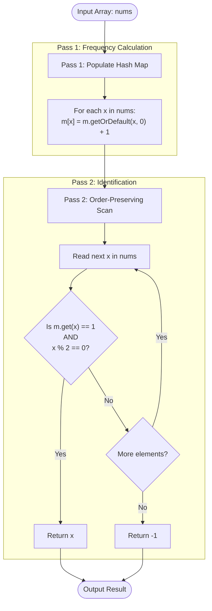

<h2><a href="https://leetcode.com/problems/first-unique-even-element">3866. First Unique Even Element</a></h2>

<p>You are given an integer array <code>nums</code>.</p>

<p>Return an integer denoting the first <strong>even</strong> integer (earliest by array index) that appears <strong>exactly</strong> once in <code>nums</code>. If no such integer exists, return -1.</p>

<p>An integer <code>x</code> is considered <strong>even</strong> if it is divisible by 2.</p>

<p>&nbsp;</p>
<p><strong class="example">Example 1:</strong></p>

<div class="example-block">
<p><strong>Input:</strong> <span class="example-io">nums = [3,4,2,5,4,6]</span></p>

<p><strong>Output:</strong> <span class="example-io">2</span></p>

<p><strong>Explanation:</strong></p>

<p>Both 2 and 6 are even and they appear exactly once. Since 2 occurs first in the array, the answer is 2.</p>
</div>

<p><strong class="example">Example 2:</strong></p>

<div class="example-block">
<p><strong>Input:</strong> <span class="example-io">nums = [4,4]</span></p>

<p><strong>Output:</strong> <span class="example-io">-1</span></p>

<p><strong>Explanation:</strong></p>

<p>No even integer appears exactly once, so return -1.</p>
</div>

<p>&nbsp;</p>
<p><strong>Constraints:</strong></p>

<ul>
	<li><code>1 &lt;= nums.length &lt;= 100</code></li>
	<li><code>1 &lt;= nums[i] &lt;= 100</code></li>
</ul>


---

# 🛍️ First-Unique-Even-Element | Explained

## Approach 1: Two-Pass Frequency Map Tracking

### Intuition
Imagine you are a teacher taking attendance for a group of students standing in line. To find the very first student who is wearing an **even-numbered jersey** and **is the only person wearing that specific jersey number**, you can't decide immediately upon seeing each student because a duplicate jersey number might show up later in line.

To solve this, you break the process into two phases:
1. **The Ledger Phase (First Pass):** Walk down the line and count how many times each jersey number appears. You record these totals in a tally book (a Hash Map).
2. **The Verification Phase (Second Pass):** Walk down the exact same line from start to finish a second time. Check your tally book for each person. The moment you find a student whose jersey number is even and has a total tally of exactly `1`, you stop and declare that student the winner.

This guarantees both conditions: uniqueness (via the map lookup) and priority (by checking elements in their original array order).

### Algorithm Visualized



### Approach
1. **Instantiate Frequency Map:** Initialize a `HashMap<Integer, Integer>` named `m` to store each element and its total occurrences.
2. **First Pass (Frequency Counting):** Iterate through `nums`. For each integer `x`, increment its count in `m` using `m.getOrDefault(x, 0) + 1`.
3. **Second Pass (Sequential Lookup):** Iterate through `nums` in its original order from index `0` to `N - 1`:
   - Retrieve the frequency of `x` from `m`.
   - Check two conditions simultaneously:
     1. `m.get(x) == 1` (The element appears exactly once across the entire array).
     2. `x % 2 == 0` (The element is an even number).
   - If both conditions evaluate to `true`, immediately return `x`.
4. **Fallback:** If the loop terminates without finding a candidate matching both criteria, return `-1`.

### Detailed Code Analysis

Let's break down the implementation line-by-line:

```java
3       HashMap<Integer,Integer> m=new HashMap<>();
```
- We initialize a standard `HashMap`. Java's `HashMap` provides average $O(1)$ time complexity for insertions and lookups using key hashing.

```java
4       for(int x:nums){
5        m.put(x,m.getOrDefault(x,0)+1);
6       }
```
- **Enhanced For-Loop (Pass 1):** We iterate through each element `x` in the primitive array `nums`.
- **`m.getOrDefault(x, 0)`:** Handles missing keys seamlessly. If `x` is not yet in the map, it returns `0`. We add `1` to record this occurrence and put it back into the map. Note that Java handles automatic boxing (`int` to `Integer`) here.

```java
7       for(int x:nums){
8        if(m.get(x)==1 && x%2==0){
9            return x;
10       }
11      }return -1;
```
- **Sequential Scan (Pass 2):** We iterate through `nums` again. Processing elements in the original sequence preserves the relative order, ensuring we find the **first** qualifying element.
- **Short-Circuit Evaluation (`&&`):**
  - `m.get(x) == 1`: Unboxes the frequency `Integer` and checks if `x` occurred exactly once.
  - `x % 2 == 0`: Uses the modulo operator to verify if the number is even.
- **Early Return:** As soon as a match is found, line `9` returns `x` immediately, halting further execution.
- **Line 11 Return:** If no element satisfies the condition after examining all array elements, the method returns `-1`.

### Code

```java
class Solution {
    public int firstUniqueEven(int[] nums) {
       HashMap<Integer, Integer> m = new HashMap<>();
       
       // Pass 1: Build the frequency map
       for (int x : nums) {
           m.put(x, m.getOrDefault(x, 0) + 1);
       }
       
       // Pass 2: Find the first unique even element
       for (int x : nums) {
           if (m.get(x) == 1 && x % 2 == 0) {
               return x;
           }
       }
       
       return -1;
    }
}
```

### Complexity

- **Time Complexity:** $\mathcal{O}(N)$
  - **Pass 1:** Iterating through `nums` takes $\mathcal{O}(N)$ time. `HashMap.put()` and `getOrDefault()` run in average $\mathcal{O}(1)$ time.
  - **Pass 2:** Iterating through `nums` takes $\mathcal{O}(N)$ time. `HashMap.get()` runs in average $\mathcal{O}(1)$ time.
  - Overall Time Complexity: $\mathcal{O}(N) + \mathcal{O}(N) = \mathcal{O}(N)$, where $N$ is the number of elements in `nums`.

- **Space Complexity:** $\mathcal{O}(N)$
  - In the worst case (where all elements in `nums` are distinct), the `HashMap` will store $N$ distinct key-value pairs, requiring $\mathcal{O}(N)$ space.
  - Auxiliary space for iteration variables is $\mathcal{O}(1)$.

---

## 🕵️‍♂️ Follow-up Questions

### 1. How would you optimize this to solve the problem in a single pass over the array?
**Answer:**
You can achieve a single-pass solution using a **`LinkedHashMap<Integer, Boolean>`** or by maintaining a custom doubly-linked list with a map (similar to an LRU cache mechanism).

With a `LinkedHashMap`:
- Store numbers as keys and a boolean representing whether the element is unique (`true`) or duplicate (`false`) as values.
- As you iterate through `nums`:
  - If `x` is odd, ignore it (or filter it early).
  - If `x` is even and not in the map, insert `(x, true)`—`LinkedHashMap` preserves insertion order.
  - If `x` is already in the map, update its value to `false`.
- After a single pass over `nums`, iterate over the `LinkedHashMap` entries. Return the first key whose value is `true`. If no key has a value of `true`, return `-1`.

### 2. What if memory is constrained, but you know the numbers fall within a fixed, small range (e.g., $1 \le nums[i] \le 1000$)?
**Answer:**
If the input range is small and bounded, replace the `HashMap` with a primitive integer array `int[] counts = new int[1001]`.

- Primitive arrays eliminate object overhead (like `Integer` wrapper objects, bucket pointers, and node allocation overhead in `HashMap`).
- Accessing `counts[x]` has zero hashing overhead and direct memory lookup, yielding better cache locality and performance while maintaining $\mathcal{O}(N)$ time and $\mathcal{O}(1)$ auxiliary space.