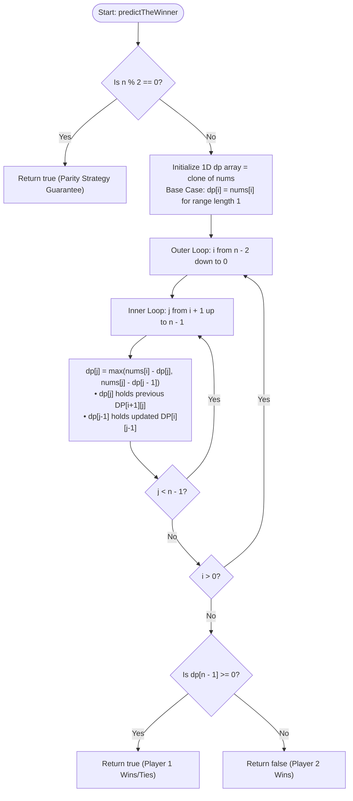

<h2><a href="https://leetcode.com/problems/predict-the-winner">486. Predict the Winner</a></h2>

<p>You are given an integer array <code>nums</code>. Two players are playing a game with this array: player 1 and player 2.</p>

<p>Player 1 and player 2 take turns, with player 1 starting first. Both players start the game with a score of <code>0</code>. At each turn, the player takes one of the numbers from either end of the array (i.e., <code>nums[0]</code> or <code>nums[nums.length - 1]</code>) which reduces the size of the array by <code>1</code>. The player adds the chosen number to their score. The game ends when there are no more elements in the array.</p>

<p>Return <code>true</code> if Player 1 can win the game. If the scores of both players are equal, then player 1 is still the winner, and you should also return <code>true</code>. You may assume that both players are playing optimally.</p>

<p>&nbsp;</p>
<p><strong class="example">Example 1:</strong></p>

<pre><strong>Input:</strong> nums = [1,5,2]
<strong>Output:</strong> false
<strong>Explanation:</strong> Initially, player 1 can choose between 1 and 2. 
If he chooses 2 (or 1), then player 2 can choose from 1 (or 2) and 5. If player 2 chooses 5, then player 1 will be left with 1 (or 2). 
So, final score of player 1 is 1 + 2 = 3, and player 2 is 5. 
Hence, player 1 will never be the winner and you need to return false.
</pre>

<p><strong class="example">Example 2:</strong></p>

<pre><strong>Input:</strong> nums = [1,5,233,7]
<strong>Output:</strong> true
<strong>Explanation:</strong> Player 1 first chooses 1. Then player 2 has to choose between 5 and 7. No matter which number player 2 choose, player 1 can choose 233.
Finally, player 1 has more score (234) than player 2 (12), so you need to return True representing player1 can win.
</pre>

<p>&nbsp;</p>
<p><strong>Constraints:</strong></p>

<ul>
	<li><code>1 &lt;= nums.length &lt;= 20</code></li>
	<li><code>0 &lt;= nums[i] &lt;= 10<sup>7</sup></code></li>
</ul>


---

# 🛍️ Predict-the-Winner | Explained

## Approach 1: Dynamic Programming (1D Space-Optimized with Parity Shortcut)

### Intuition
This problem can be modeled as a **zero-sum, turn-based minimax game**. Two rational players aim to maximize their own scores relative to the opponent. Instead of tracking both players' scores independently, we can track the **net score difference**: 
$$\text{Net Score} = \text{Player 1 Score} - \text{Player 2 Score}$$

Whenever the current player picks a number $X$, they add $X$ to their net score. The opponent then plays optimally on the remaining array, yielding a net relative advantage of $\text{dp}[\text{remaining}]$. Thus, from the current player's perspective, choosing $X$ nets them a relative advantage of:
$$X - \text{dp}[\text{remaining}]$$

#### The Even-Length Mathematical Shortcut
If $n$ (the length of `nums`) is **even**, Player 1 can **always win or tie**. 
Why? Player 1 can choose to take either **all even-indexed elements** or **all odd-indexed elements**:
1. If Player 1 picks `nums[0]` (even index), Player 2 is forced to pick from indices $1$ or $n-1$ (both odd indices).
2. For every subsequent turn, Player 1 can maintain this parity choice, effectively guaranteeing they get all even-indexed elements or all odd-indexed elements.
3. Since Player 1 can calculate $\sum \text{evens}$ and $\sum \text{odds}$ beforehand, they simply choose the strategy that yields $\ge$ the other. Thus, for even $n$, Player 1 immediately wins.

#### 2D to 1D Dynamic Programming Optimization
When $n$ is odd, we use Dynamic Programming. 
Let $DP[i][j]$ be the maximum net score difference the current player can achieve from the subarray `nums[i...j]`.
- Picking `nums[i]` gives `nums[i] - DP[i + 1][j]`
- Picking `nums[j]` gives `nums[j] - DP[i][j - 1]`
- $DP[i][j] = \max(\text{nums}[i] - DP[i + 1][j], \; \text{nums}[j] - DP[i][j - 1])$

Notice that $DP[i][j]$ depends only on $DP[i + 1][j]$ (from the previous lower-bound row $i + 1$) and $DP[i][j - 1]$ (from the current row $i$, previous column $j - 1$). By processing $i$ from $n - 2$ down to $0$ and $j$ from $i + 1$ up to $n - 1$, we can collapse the matrix into a single 1D array `dp` of size $n$.

### Algorithm Visualized



### Approach
1. **Check Parity**: If `nums.length % 2 == 0`, return `true` immediately.
2. **Initialize DP**: Create a 1D array `dp` initialized as a copy of `nums`. This represents the base cases where $i = j$ (subarrays of length $1$).
3. **Iterate Subarray Boundaries**:
   - Outer loop $i$ iterates backwards from $n - 2$ down to $0$. This represents the left boundary of the subarray.
   - Inner loop $j$ iterates forwards from $i + 1$ to $n - 1$. This represents the right boundary of the subarray.
4. **State Update**:
   - `dp[j]` before update holds $DP[i + 1][j]$ (the result from the previous iteration of $i$).
   - `dp[j - 1]` holds $DP[i][j - 1]$ (already updated in the current inner loop iteration).
   - Update `dp[j] = Math.max(nums[i] - dp[j], nums[j] - dp[j - 1])`.
5. **Evaluate Result**: `dp[n - 1]` now holds $DP[0][n - 1]$, which is the maximum net score Player 1 can achieve over the entire array. If `dp[n - 1] >= 0`, Player 1 wins or ties (`true`); otherwise, `false`.

### Detailed Code Analysis

```java
class Solution {
    public boolean predictTheWinner(int[] nums) {
        int n = nums.length;
        
        // Parity shortcut: If array length is even, Player 1 can always 
        // force a win or tie by choosing all even-indexed or all odd-indexed numbers.
        if (n % 2 == 0) return true;
        
        // Base case: dp[k] initially stores DP[k][k] = nums[k].
        // This represents a subarray of length 1 where the only choice is nums[k].
        int[] dp = nums.clone();
        
        // Build DP states bottom-up for increasing subarray lengths.
        // i goes backwards to ensure dp[j] (which acts as DP[i+1][j]) is ready.
        for (int i = n - 2; i >= 0; --i) {
            for (int j = i + 1; j < n; ++j) {
                // nums[i] - dp[j]   => Pick left element nums[i], subtract optimal score of remaining range [i+1...j]
                // nums[j] - dp[j-1] => Pick right element nums[j], subtract optimal score of remaining range [i...j-1]
                dp[j] = Math.max(nums[i] - dp[j], nums[j] - dp[j - 1]);
            }
        }
        
        // dp[n - 1] represents DP[0][n - 1], the final net score difference for the whole array.
        // Player 1 wins if net difference >= 0.
        return dp[n - 1] >= 0;
    }
}
```

### Code
```java
class Solution {
    public boolean predictTheWinner(int[] nums) {
        int n = nums.length;
        if (n % 2 == 0) return true;
        
        int[] dp = nums.clone();
        for (int i = n - 2; i >= 0; --i) {
            for (int j = i + 1; j < n; ++j) {
                dp[j] = Math.max(nums[i] - dp[j], nums[j] - dp[j - 1]);
            }
        }
        return dp[n - 1] >= 0;
    }
}
```

### Complexity
- **Time Complexity:** 
  - **Best Case:** $\mathcal{O}(1)$ when $n$ is even due to the parity shortcut `if (n % 2 == 0) return true;`.
  - **Worst Case:** $\mathcal{O}(n^2)$ when $n$ is odd, as we evaluate the upper triangle of the $n \times n$ subproblem matrix via the nested loops ($\frac{n(n-1)}{2}$ iterations).
- **Space Complexity:** $\mathcal{O}(n)$ auxiliary space to store the 1D DP array of size $n$, optimizing down from $\mathcal{O}(n^2)$ required by standard 2D DP.

---

## 🕵️‍♂️ Follow-up Questions

### 1. Why does the parity strategy guarantee a win ONLY for even lengths?
**Answer:** When $n$ is even, the indices alternate parity starting with $0$ (even) and ending with $n-1$ (odd). 
- Player 1 can choose index $0$ (even), leaving bounds $1$ (odd) and $n-1$ (odd). Player 2 is forced to pick an odd index.
- Player 1 can repeat this strategy throughout the entire game to collect **all** even-indexed elements.
- Alternatively, Player 1 can start by picking index $n-1$ (odd), forcing Player 2 to pick from even bounds, thereby collecting **all** odd-indexed elements.

When $n$ is **odd**, both ends of the array start with even indices ($0$ and $n-1$). Player 1 cannot force Player 2 into taking exclusively odd or even indices because Player 2's choices will alter the parity of available endpoints for subsequent turns.

### 2. How would you modify the solution if you needed to return Player 1's exact total score instead of a boolean?
**Answer:**
Let $\text{Net} = DP[0][n-1]$ be the final relative difference ($\text{Score}_1 - \text{Score}_2$), and $S = \sum_{k=0}^{n-1} \text{nums}[k]$ be the total sum of all elements.

We have a system of two equations:
1. $\text{Score}_1 + \text{Score}_2 = S$
2. $\text{Score}_1 - \text{Score}_2 = \text{Net}$

Adding both equations yields:
$$2 \cdot \text{Score}_1 = S + \text{Net} \implies \text{Score}_1 = \frac{S + \text{Net}}{2}$$

To return Player 1's exact score, compute the total sum $S$ of `nums` and return `(S + dp[n - 1]) / 2`.