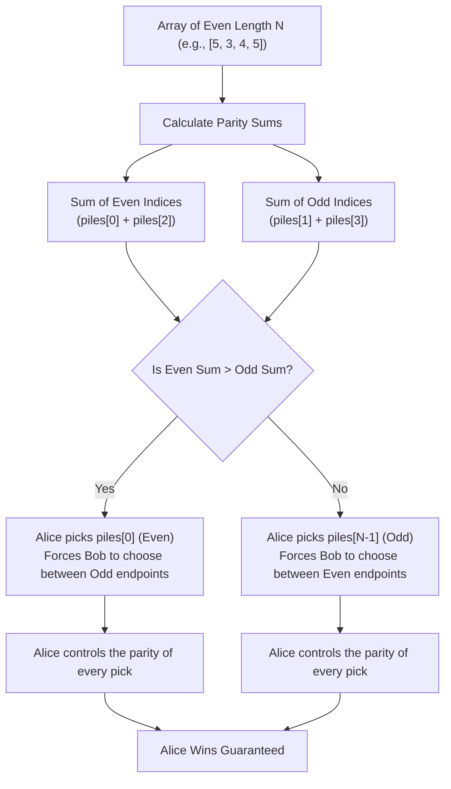

<h2><a href="https://leetcode.com/problems/stone-game">877. Stone Game</a></h2>

<p>Alice and Bob play a game with piles of stones. There are an <strong>even</strong> number of piles arranged in a row, and each pile has a <strong>positive</strong> integer number of stones <code>piles[i]</code>.</p>

<p>The objective of the game is to end with the most stones. The <strong>total</strong> number of stones across all the piles is <strong>odd</strong>, so there are no ties.</p>

<p>Alice and Bob take turns, with <strong>Alice starting first</strong>. Each turn, a player takes the entire pile of stones either from the <strong>beginning</strong> or from the <strong>end</strong> of the row. This continues until there are no more piles left, at which point the person with the <strong>most stones wins</strong>.</p>

<p>Assuming Alice and Bob play optimally, return <code>true</code><em> if Alice wins the game, or </em><code>false</code><em> if Bob wins</em>.</p>

<p>&nbsp;</p>
<p><strong class="example">Example 1:</strong></p>

<pre><strong>Input:</strong> piles = [5,3,4,5]
<strong>Output:</strong> true
<strong>Explanation:</strong> 
Alice starts first, and can only take the first 5 or the last 5.
Say she takes the first 5, so that the row becomes [3, 4, 5].
If Bob takes 3, then the board is [4, 5], and Alice takes 5 to win with 10 points.
If Bob takes the last 5, then the board is [3, 4], and Alice takes 4 to win with 9 points.
This demonstrated that taking the first 5 was a winning move for Alice, so we return true.
</pre>

<p><strong class="example">Example 2:</strong></p>

<pre><strong>Input:</strong> piles = [3,7,2,3]
<strong>Output:</strong> true
</pre>

<p>&nbsp;</p>
<p><strong>Constraints:</strong></p>

<ul>
	<li><code>2 &lt;= piles.length &lt;= 500</code></li>
	<li><code>piles.length</code> is <strong>even</strong>.</li>
	<li><code>1 &lt;= piles[i] &lt;= 500</code></li>
	<li><code>sum(piles[i])</code> is <strong>odd</strong>.</li>
</ul>


---

# 🛍️ Stone-Game | Explained

## Approach 1: Mathematical Parity / First-Player Strategy
### Intuition
The Stone Game problem presents a game played with an even number of piles arranged in a row, where the total sum of all stones across all piles is odd (meaning no ties are possible). 

While this problem appears to be a classic dynamic programming or minimax game theory challenge at first glance, a deep mathematical property allows us to solve it in constant time $O(1)$.

Because the number of piles $N$ is even:
1. We can divide the piles into two groups based on their array index: **Even-indexed piles** (`piles[0]`, `piles[2]`, `piles[4]`, ...) and **Odd-indexed piles** (`piles[1]`, `piles[3]`, `piles[5]`, ...).
2. The total sum of stones is odd, which strictly guarantees that:
   $$\text{Sum(Even Piles)} \neq \text{Sum(Odd Piles)}$$
   Therefore, one of these two sums **must** be strictly greater than the other.
3. The first player (Alice) can choose to collect **all** even-indexed piles or **all** odd-indexed piles:
   - If Alice wants all even-indexed piles, she picks `piles[0]` on her first turn. This leaves Bob facing the remaining sub-array from `piles[1]` to `piles[N-1]`. Both available ends for Bob (`piles[1]` and `piles[N-1]`) are **odd** indices!
   - Whichever odd pile Bob takes, he exposes an **even** index pile for Alice's next turn.
   - Conversely, if Alice wants all odd-indexed piles, she picks `piles[N-1]` on turn 1, forcing Bob to only pick even-indexed piles.

Because Alice plays first and knows both sums in advance, she can simply calculate which group has the larger total sum and execute that strategy to guarantee a win every single time. Thus, Alice **always** wins.

### Algorithm Visualized


### Approach
1. Evaluate if the total number of elements in the `piles` array is even (`piles.length % 2 == 0`).
2. Per the problem statement constraints, `piles.length` is always even, and total stones are odd.
3. Because Alice has a deterministic winning strategy for any even-length array under these constraints, the function returns `true`.

### Detailed Code Analysis
Let's analyze the exact implementation provided:

```java
1class Solution {
2    public boolean stoneGame(int[] piles) {
3        if(piles.length%2==0)return true;
4        return false;
5    }
6}
```

* **Line 2 (`public boolean stoneGame(int[] piles)`):** Defines the entry point method taking an integer array `piles` and returning a boolean indicating if Alice wins.
* **Line 3 (`if(piles.length%2==0)return true;`):** 
  - `piles.length` retrieves the number of elements in the input array.
  - `% 2 == 0` performs a bitwise/arithmetic modulo operation to check parity (whether the length of the array is even).
  - If the length is even, it immediately returns `true`, reflecting Alice's guaranteed victory via the parity strategy.
* **Line 4 (`return false;`):** 
  - Serves as a fallback return statement to satisfy Java's strict compiler requirement for a boolean return value along all control paths.
  - In practice, under the problem's strict constraint ($2 \le \text{piles.length} \le 500$ and $\text{piles.length}$ is even), control flow will never reach Line 4.

### Code
```java
class Solution {
    public boolean stoneGame(int[] piles) {
        if (piles.length % 2 == 0) return true;
        return false;
    }
}
```

### Complexity
- **Time Complexity:** $\mathcal{O}(1)$ — The code performs a single array length retrieval and modulo operation, executing in constant time regardless of array size.
- **Space Complexity:** $\mathcal{O}(1)$ — No additional memory or memory structures are allocated.

---

## 🕵️‍♂️ Follow-up Questions

### 1. How would you solve this problem if `piles.length` could be odd, or if we needed to return the maximum score difference instead of just a boolean?
**Answer:** We would use **Dynamic Programming with Minimax Game Theory**. 

We define $dp[i][j]$ as the maximum relative score difference (Alice's score minus Bob's score) achievable from the subarray `piles[i...j]`.

- **Base Case:** $dp[i][i] = piles[i]$ (only one pile remains, current player takes it).
- **State Transition:** 
  $$dp[i][j] = \max(piles[i] - dp[i+1][j], \ piles[j] - dp[i][j-1])$$
- If $dp[0][N-1] > 0$, Alice wins.

This approach takes $\mathcal{O}(N^2)$ time and $\mathcal{O}(N^2)$ space (which can be optimized to $\mathcal{O}(N)$ space).

### 2. Can Alice still guarantee a win if total stone count can be even (allowing ties)?
**Answer:** Not necessarily. If ties are possible (e.g., total sum is even), the maximum sum of even-indexed piles could equal the maximum sum of odd-indexed piles (e.g., `piles = [2, 2, 2, 2]`). In that scenario, both players can play optimally to force a tie, meaning Alice cannot guarantee a strict win (`Alice's Score > Bob's Score`).