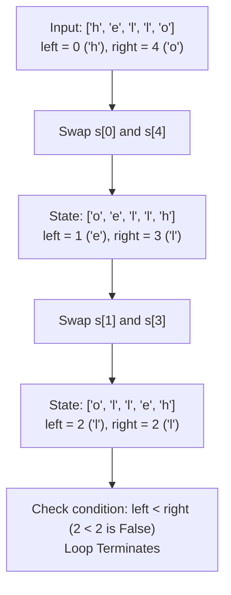

<h2><a href="https://leetcode.com/problems/reverse-string">344. Reverse String</a></h2>

<p>Write a function that reverses a string. The input string is given as an array of characters <code>s</code>.</p>

<p>You must do this by modifying the input array <a href="https://en.wikipedia.org/wiki/In-place_algorithm" target="_blank">in-place</a> with <code>O(1)</code> extra memory.</p>

<p>&nbsp;</p>
<p><strong class="example">Example 1:</strong></p>
<pre><strong>Input:</strong> s = ["h","e","l","l","o"]
<strong>Output:</strong> ["o","l","l","e","h"]
</pre><p><strong class="example">Example 2:</strong></p>
<pre><strong>Input:</strong> s = ["H","a","n","n","a","h"]
<strong>Output:</strong> ["h","a","n","n","a","H"]
</pre>
<p>&nbsp;</p>
<p><strong>Constraints:</strong></p>

<ul>
	<li><code>1 &lt;= s.length &lt;= 10<sup>5</sup></code></li>
	<li><code>s[i]</code> is a <a href="https://en.wikipedia.org/wiki/ASCII#Printable_characters" target="_blank">printable ascii character</a>.</li>
</ul>


---

# 🛍️ Reverse-String | Explained

## Approach 1: Two Pointers (In-Place Swapping)

### Intuition
Imagine you have a line of physical blocks on a table, each printed with a letter. To reverse the order of these blocks without using an extra table (in-place), you can place your left hand on the first block and your right hand on the last block. You swap their positions. Next, you step your left hand one block to the right and your right hand one block to the left, repeating the swap operation. You continue this process until your hands meet in the center or cross each other.

This symmetric converging mechanism ensures that every character is swapped with its exact mirror counterpart across the center of the array, achieving a full reversal in minimal operations.

### Algorithm Visualized


### Approach
1. **Initialize Pointers**: Define two integer variables acting as array indices:
   - `left` pointing to index `0` (the start of the array).
   - `right` pointing to index `s.length - 1` (the end of the array).
2. **Loop Condition**: Execute a `while` loop that runs as long as `left < right`. 
   - If the array has an odd length, the middle element does not need to be swapped, so `left == right` serves as a natural stopping point.
   - If the array has an even length, the pointers will cross (`left > right`) after swapping the innermost pair.
3. **Element Swap**: Within each iteration, perform a classic 3-step value exchange:
   - Temporarily cache `s[left]` in a variable `temp`.
   - Overwrite `s[left]` with the character at `s[right]`.
   - Assign the cached `temp` value to `s[right]`.
4. **Pointer Advance**: Increment `left` by 1 and decrement `right` by 1 to move inward towards the center.
5. **Termination**: Once `left < right` becomes `false`, the array has been mutated fully in-place.

### Detailed Code Analysis

- **Lines 3–4: Pointer Initialization**
  ```java
  int left = 0;
  int right = s.length - 1;
  ```
  Here, two primitive integers are instantiated on the stack. `left` bounds the unprocessed left boundary, while `right` bounds the unprocessed right boundary. Using primitive integers ensures optimal register access with zero heap allocation overhead.

- **Line 5: Loop Execution Boundary**
  ```java
  while (left < right) {
  ```
  This evaluation ensures that processing terminates immediately when pointers meet at the center element (for odd lengths) or cross (for even lengths). It prevents redundant swaps that would otherwise un-reverse elements already swapped.

- **Lines 6–8: The Variable Swap Block**
  ```java
  char temp = s[left];
  s[left] = s[right];
  s[right] = temp;
  ```
  Because array modifications happen in memory directly, overwriting `s[left] = s[right]` would destroy the original value of `s[left]`. The temporary variable `temp` (stored in CPU register/stack) preserves `s[left]` during the double assignment.

- **Lines 9–10: Pointer Convergence**
  ```java
  left++;
  right--;
  ```
  The pointers step symmetrically toward the center. `left++` moves the left cursor forward, and `right--` moves the right cursor backward, reducing the problem size by 2 elements per iteration.

### Code
```java
class Solution {
    public void reverseString(char[] s) {
        int left = 0;
        int right = s.length - 1;
        while (left < right) {
            char temp = s[left];
            s[left] = s[right];
            s[right] = temp;
            left++;
            right--;
        }
    }
}
```

### Complexity
- **Time:** $\mathcal{O}(N)$ — Where $N$ is the number of elements in the character array `s`. The loop runs $\lfloor N / 2 \rfloor$ times. Since each iteration involves constant-time $\mathcal{O}(1)$ swap operations, the overall time complexity scales linearly with the size of the array.
- **Space:** $\mathcal{O}(1)$ — Auxiliary space is strictly constant. The algorithm modifies the input array in-place without allocating auxiliary arrays or dynamically sized structures. Memory consumption relies solely on three primitive stack variables (`left`, `right`, and `temp`).

---

## 🕵️‍♂️ Follow-up Questions (Optional)

### 1. How would you handle Unicode multi-byte characters (e.g., UTF-16 surrogate pairs like emojis) in Java?
**Answer:** In Java, `char` is a 16-bit code unit representing UTF-16. Characters outside the Basic Multilingual Plane (like many emojis) are represented using **surrogate pairs**—two consecutive `char` elements (a high surrogate followed by a low surrogate). A naive character-by-character reversal breaks these surrogate pairs, reversing their internal order and rendering them corrupt.

To fix this, we must check if `s[left]` and `s[right]` belong to surrogate pairs using `Character.isHighSurrogate()` and `Character.isLowSurrogate()`. When encountered, we must swap the entire 2-char block together rather than swapping single code units individually.

### 2. Can this problem be solved recursively, and what are the architectural trade-offs?
**Answer:** Yes, a recursive implementation can swap `s[left]` and `s[right]` and then call `reverse(s, left + 1, right - 1)`. 

While the time complexity remains $\mathcal{O}(N)$, the auxiliary space complexity degrades from $\mathcal{O}(1)$ to $\mathcal{O}(N)$ because each recursive call pushes a frame onto the runtime call stack. For massive array lengths (e.g., $N > 10^5$), this risks triggering a `StackOverflowError`. Thus, the iterative two-pointer approach is strictly superior in production environments.