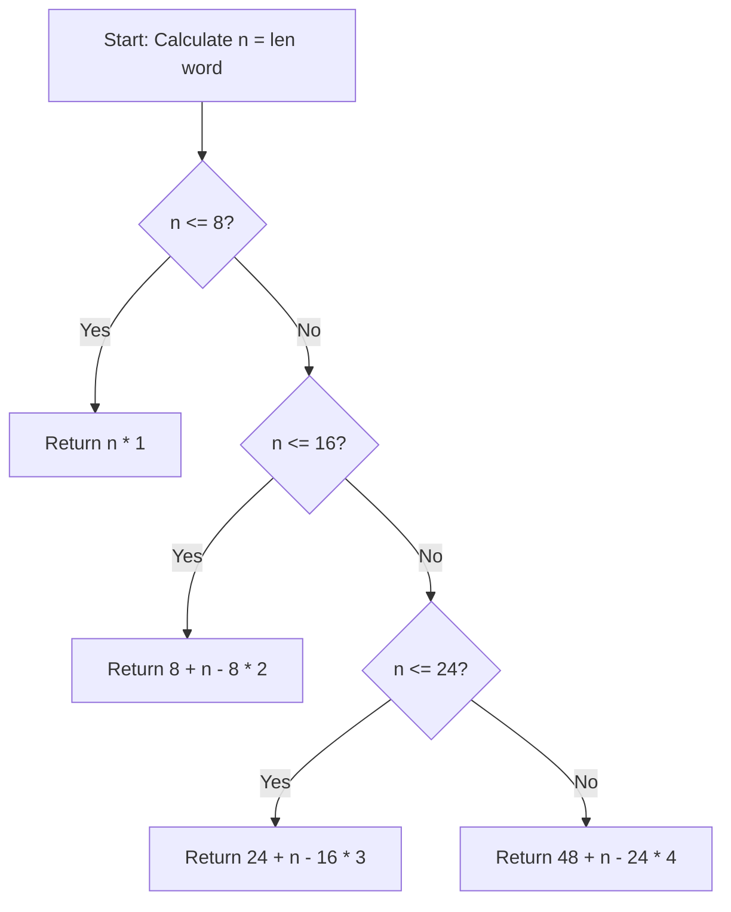

<h2><a href="https://leetcode.com/problems/minimum-number-of-pushes-to-type-word-i">3014. Minimum Number of Pushes to Type Word I</a></h2>

<p>You are given a string <code>word</code> containing <strong>distinct</strong> lowercase English letters.</p>

<p>Telephone keypads have keys mapped with <strong>distinct</strong> collections of lowercase English letters, which can be used to form words by pushing them. For example, the key <code>2</code> is mapped with <code>["a","b","c"]</code>, we need to push the key one time to type <code>"a"</code>, two times to type <code>"b"</code>, and three times to type <code>"c"</code> <em>.</em></p>

<p>It is allowed to remap the keys numbered <code>2</code> to <code>9</code> to <strong>distinct</strong> collections of letters. The keys can be remapped to <strong>any</strong> amount of letters, but each letter <strong>must</strong> be mapped to <strong>exactly</strong> one key. You need to find the <strong>minimum</strong> number of times the keys will be pushed to type the string <code>word</code>.</p>

<p>Return <em>the <strong>minimum</strong> number of pushes needed to type </em><code>word</code> <em>after remapping the keys</em>.</p>

<p>An example mapping of letters to keys on a telephone keypad is given below. Note that <code>1</code>, <code>*</code>, <code>#</code>, and <code>0</code> do <strong>not</strong> map to any letters.</p>

<p>&nbsp;</p>
<p><strong class="example">Example 1:</strong></p>

<pre><strong>Input:</strong> word = "abcde"
<strong>Output:</strong> 5
<strong>Explanation:</strong> The remapped keypad given in the image provides the minimum cost.
"a" -&gt; one push on key 2
"b" -&gt; one push on key 3
"c" -&gt; one push on key 4
"d" -&gt; one push on key 5
"e" -&gt; one push on key 6
Total cost is 1 + 1 + 1 + 1 + 1 = 5.
It can be shown that no other mapping can provide a lower cost.
</pre>

<p><strong class="example">Example 2:</strong></p>

<pre><strong>Input:</strong> word = "xycdefghij"
<strong>Output:</strong> 12
<strong>Explanation:</strong> The remapped keypad given in the image provides the minimum cost.
"x" -&gt; one push on key 2
"y" -&gt; two pushes on key 2
"c" -&gt; one push on key 3
"d" -&gt; two pushes on key 3
"e" -&gt; one push on key 4
"f" -&gt; one push on key 5
"g" -&gt; one push on key 6
"h" -&gt; one push on key 7
"i" -&gt; one push on key 8
"j" -&gt; one push on key 9
Total cost is 1 + 2 + 1 + 2 + 1 + 1 + 1 + 1 + 1 + 1 = 12.
It can be shown that no other mapping can provide a lower cost.
</pre>

<p>&nbsp;</p>
<p><strong>Constraints:</strong></p>

<ul>
	<li><code>1 &lt;= word.length &lt;= 26</code></li>
	<li><code>word</code> consists of lowercase English letters.</li>
	<li>All letters in <code>word</code> are distinct.</li>
</ul>


---

# 🛍️ Minimum-Number-of-Pushes-to-Type-Word-I | Explained

## Approach 1: Range-Based Mathematical Bucket Mapping
### Intuition
Think of a traditional telephone keypad with 8 available digit keys (2 through 9). Each key can hold multiple distinct characters. To minimize the total number of key presses, we want to place as many characters as possible in the 1st position of each key (requiring 1 push), then filling the 2nd position of each key (requiring 2 pushes), and so on.

Since the problem constraints for Word I guarantee that all characters in `word` are distinct, the order of characters doesn't matter. We simply divide the total length of the word into buckets of size 8:
- The first 8 characters take 1 push each.
- The next 8 characters (9 to 16) take 2 pushes each.
- The next 8 characters (17 to 24) take 3 pushes each.
- The final 2 characters (25 to 26) take 4 pushes each.

### Algorithm Visualized


### Approach
1. Compute the length of the string `n`.
2. Evaluate which size range `n` falls into based on chunks of 8 keys:
   - **Range 1 (`n <= 8`)**: Every character is assigned to a distinct key's 1st slot. Total pushes = $n \times 1$.
   - **Range 2 (`8 < n <= 16`)**: 8 characters use 1 push each (8 total). The remaining $x = n - 8$ characters use 2 pushes each. Total pushes = $8 + x \times 2$.
   - **Range 3 (`16 < n <= 24`)**: 8 characters use 1 push (8 total) + 8 characters use 2 pushes (16 total) = 24 base pushes. The remaining $x_3 = n - 16$ characters use 3 pushes each. Total pushes = $24 + x_3 \times 3$.
   - **Range 4 (`24 < n <= 26`)**: 8 characters use 1 push (8) + 8 characters use 2 pushes (16) + 8 characters use 3 pushes (24) = 48 base pushes. The remaining $x_4 = n - 24$ characters use 4 pushes each. Total pushes = $48 + x_4 \times 4$.

### Detailed Code Analysis
- `n = len(word)`: Retrieves the length of the word in $O(1)$ time for Python strings.
- `if n <= 8:`: Directly handles words that fit on the 1st key press level without needing offset math.
- `elif n > 8 and n <= 16:`: Handles words requiring up to 2 pushes per letter.
  - `x = n - 8`: Calculates the overflow count beyond the first 8 characters.
  - `return 8 + x * 2`: Computes cost of first 8 characters ($8 \times 1$) plus remainder cost ($x \times 2$).
- `elif n > 16 and n <= 24:`: Handles words requiring up to 3 pushes per letter.
  - `x3 = n - 16`: Calculates the overflow count beyond 16 characters.
  - `return 24 + x3 * 3`: Computes cumulative cost of first 16 characters ($8 \times 1 + 8 \times 2 = 24$) plus remainder cost ($x_3 \times 3$).
- `elif n > 24 and n <= 26:`: Handles the maximum length string (up to 26 English letters).
  - `x4 = n - 24`: Calculates the overflow count beyond 24 characters.
  - `return 48 + x4 * 4`: Computes cumulative cost of first 24 characters ($8 + 16 + 24 = 48$) plus remainder cost ($x_4 \times 4$).

### Code
```python
class Solution(object):
    def minimumPushes(self, word):
        n = len(word)
        if n <= 8:
            return n
        elif n > 8 and n <= 16:
            x = n - 8
            if x <= 8:
                return 8 + x * 2
        elif n > 16 and n <= 24:
            x3 = n - 16
            return 24 + x3 * 3
        elif n > 24 and n <= 26:
            x4 = n - 24
            return 48 + x4 * 4
```

### Complexity
- **Time Complexity:** $\mathcal{O}(1)$ — Finding the length of a string in Python is an $\mathcal{O}(1)$ operation, and the subsequent conditional branches execute in constant time.
- **Space Complexity:** $\mathcal{O}(1)$ — Memory usage is minimal and fixed, requiring only a few integer variables (`n`, `x`, `x3`, `x4`).

## 🕵️‍♂️ Follow-up Questions (Optional)

**1. How would this solution change for "Minimum Number of Pushes to Type Word II", where characters in `word` can repeat and are not all distinct?**
*Answer:* In Word II, we must count letter frequencies using a hash map or array, sort frequencies in descending order, and greedily map the most frequent characters to the 1st key position (1 push), the next 8 most frequent to the 2nd position (2 pushes), and so forth.

**2. Can this conditional logic be simplified into a single mathematical formula?**
*Answer:* Yes. Instead of multiple `if/elif` branches, we could loop or directly compute the distribution using division/modulo or greedy multiplication once frequencies are sorted.