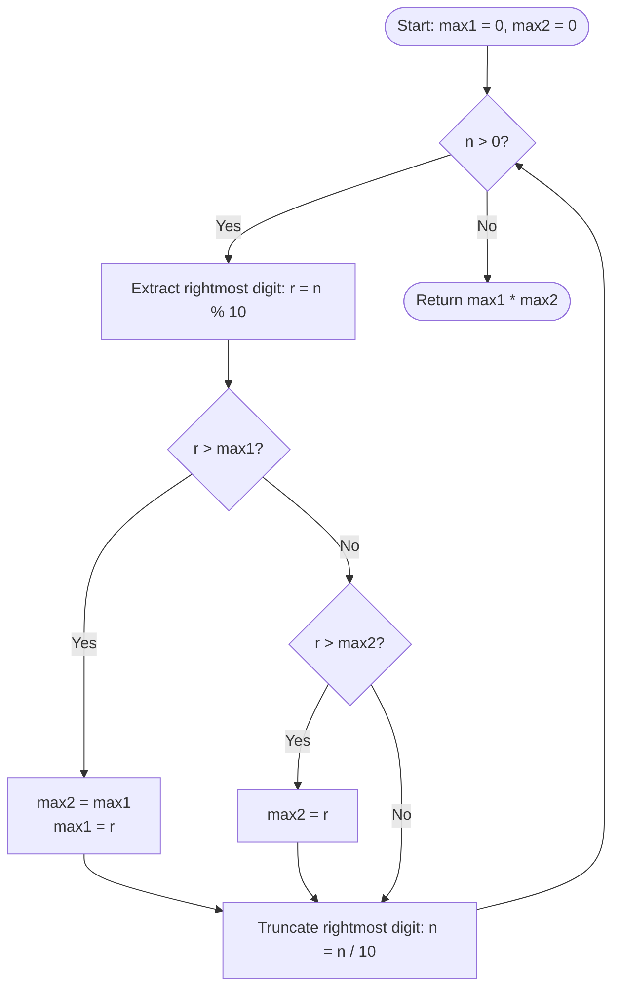

<h2><a href="https://leetcode.com/problems/maximum-product-of-two-digits">3536. Maximum Product of Two Digits</a></h2>

<p>You are given a positive integer <code>n</code>.</p>

<p>Return the <strong>maximum</strong> product of any two digits in <code>n</code>.</p>

<p><strong>Note:</strong> You may use the <strong>same</strong> digit twice if it appears more than once in <code>n</code>.</p>

<p>&nbsp;</p>
<p><strong class="example">Example 1:</strong></p>

<div class="example-block">
<p><strong>Input:</strong> <span class="example-io">n = 31</span></p>

<p><strong>Output:</strong> <span class="example-io">3</span></p>

<p><strong>Explanation:</strong></p>

<ul>
	<li>The digits of <code>n</code> are <code>[3, 1]</code>.</li>
	<li>The possible products of any two digits are: <code>3 * 1 = 3</code>.</li>
	<li>The maximum product is 3.</li>
</ul>
</div>

<p><strong class="example">Example 2:</strong></p>

<div class="example-block">
<p><strong>Input:</strong> <span class="example-io">n = 22</span></p>

<p><strong>Output:</strong> <span class="example-io">4</span></p>

<p><strong>Explanation:</strong></p>

<ul>
	<li>The digits of <code>n</code> are <code>[2, 2]</code>.</li>
	<li>The possible products of any two digits are: <code>2 * 2 = 4</code>.</li>
	<li>The maximum product is 4.</li>
</ul>
</div>

<p><strong class="example">Example 3:</strong></p>

<div class="example-block">
<p><strong>Input:</strong> <span class="example-io">n = 124</span></p>

<p><strong>Output:</strong> <span class="example-io">8</span></p>

<p><strong>Explanation:</strong></p>

<ul>
	<li>The digits of <code>n</code> are <code>[1, 2, 4]</code>.</li>
	<li>The possible products of any two digits are: <code>1 * 2 = 2</code>, <code>1 * 4 = 4</code>, <code>2 * 4 = 8</code>.</li>
	<li>The maximum product is 8.</li>
</ul>
</div>

<p>&nbsp;</p>
<p><strong>Constraints:</strong></p>

<ul>
	<li><code>10 &lt;= n &lt;= 10<sup>9</sup></code></li>
</ul>


---

# 🛍️ Maximum-Product-of-Two-Digits | Explained

## Approach 1: Single-Pass Digit Extraction (Tracking Top Two Max Digits)

### Intuition
Imagine you are watching numbers fly past on a digital banner, one digit at a time from right to left, and your goal is to identify the two highest single-digit numbers you've seen so far. You keep two sticky notes: one labeled `max1` for the absolute highest digit found so far, and another labeled `max2` for the second-highest digit. 

When a new digit arrives:
1. If it beats your current champion (`max1`), your previous champion gets demoted to second place (`max2 = max1`), and the new digit takes the top spot (`max1 = digit`).
2. If it isn't larger than `max1`, but beats your current runner-up (`max2`), it simply replaces the runner-up (`max2 = digit`).

Because digits are non-negative, multiplying the two largest digits naturally yields the maximum possible product of any two digits in the number.

### Algorithm Visualized



### Approach
1. **Initialize Trackers:** Maintain two integer variables, `max1` and `max2`, initialized to `0` to keep track of the largest and second-largest digits found.
2. **Iterative Digit Extraction:** Use a `while` loop that runs as long as `n > 0`:
   - Obtain the least significant digit (rightmost) using the modulo operator `r = n % 10`.
   - Update `max1` and `max2` using conditional checks to ensure they always hold the top two maximum values.
   - Remove the least significant digit by performing integer division `n /= 10`.
3. **Compute Result:** Return the product `max1 * max2`.

### Detailed Code Analysis

- **Lines 3–4 (`int max1=0; int max2=0;`):** Initializes local variables to store the largest and second-largest digits encountered. Since single-digit numbers range from `0` to `9`, initializing them to `0` covers all possible digit inputs safely.
- **Line 5 (`while(n>0)`):** Continuously processes the integer `n` digit-by-digit until all digits have been shifted out and `n` becomes `0`.
- **Line 6 (`int r=n%10;`):** Computes `n % 10` to extract the trailing digit of `n`.
- **Lines 7–10 (`if(r>max1){ max2=max1; max1=r; }`):** Executes when the extracted digit `r` is strictly greater than the current maximum `max1`. Before updating `max1` to `r`, `max2` takes the old value of `max1` so that the previous largest value isn't lost.
- **Lines 10–12 (`else if(r>max2){ max2=r; }`):** Handles the scenario where `r` is not strictly greater than `max1`, but is greater than `max2`. It updates `max2` directly without altering `max1`. (This logic correctly handles duplicate digits, e.g., if `r == max1`, it will fall into this branch and set `max2 = r`).
- **Line 13 (`n/=10;`):** Performs integer division by `10`, shifting the remaining digits of `n` one place to the right and discarding the digit just processed.
- **Line 14 (`return max1* max2;`):** Computes and returns the product of the two largest digits identified.

### Code
```java
class Solution {
    public int maxProduct(int n) {
        int max1 = 0;
        int max2 = 0;
        while (n > 0) {
            int r = n % 10;
            if (r > max1) {
                max2 = max1;
                max1 = r;
            } else if (r > max2) {
                max2 = r;
            }
            n /= 10;
        }
        return max1 * max2;
    }
}
```

### Complexity
- **Time Complexity:** $\mathcal{O}(\log_{10} n)$ / $\mathcal{O}(d)$, where $d$ is the number of digits in integer $n$. Each iteration processes exactly one digit in constant time $\mathcal{O}(1)$. Since a standard 32-bit integer has at most 10 digits, the loop runs at most 10 times, making execution virtually $\mathcal{O}(1)$ in practice.
- **Space Complexity:** $\mathcal{O}(1)$. The algorithm operates using a constant amount of memory with only local primitive integer storage (`max1`, `max2`, `r`).

## 🕵️‍♂️ Follow-up Questions (Optional)

1. **How would you handle negative inputs for $n$?**
   - *Answer:* Digits are non-negative components of a number representation. If $n$ could be negative, we can take `n = Math.abs(n)` at the start of the function before entering the loop.

2. **Can this solution be adapted if $n$ is provided as a `String` rather than an `int`?**
   - *Answer:* Yes. Converting an `int` to a string or receiving a `String` directly allows iterating over characters from index `0` to `length() - 1`. Convert each character to an integer value (`ch - '0'`) and perform the exact same tracking logic. This avoids integer overflow issues if $n$ exceeds standard integer bounds.