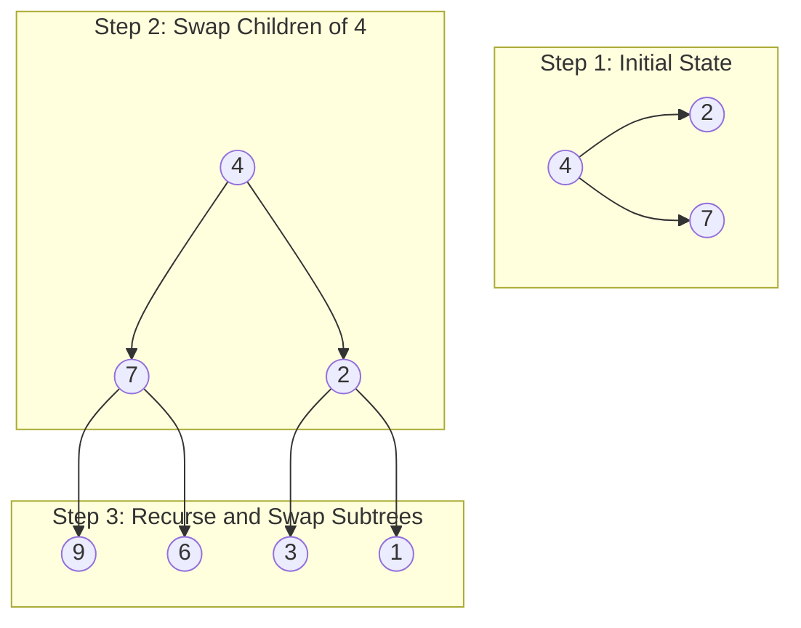

<h2><a href="https://leetcode.com/problems/invert-binary-tree">226. Invert Binary Tree</a></h2>

<p>Given the <code>root</code> of a binary tree, invert the tree, and return <em>its root</em>.</p>

<p>&nbsp;</p>
<p><strong class="example">Example 1:</strong></p>

<pre><strong>Input:</strong> root = [4,2,7,1,3,6,9]
<strong>Output:</strong> [4,7,2,9,6,3,1]
</pre>

<p><strong class="example">Example 2:</strong></p>

<pre><strong>Input:</strong> root = [2,1,3]
<strong>Output:</strong> [2,3,1]
</pre>

<p><strong class="example">Example 3:</strong></p>

<pre><strong>Input:</strong> root = []
<strong>Output:</strong> []
</pre>

<p>&nbsp;</p>
<p><strong>Constraints:</strong></p>

<ul>
	<li>The number of nodes in the tree is in the range <code>[0, 100]</code>.</li>
	<li><code>-100 &lt;= Node.val &lt;= 100</code></li>
</ul>


---

# 🛍️ Invert-Binary-Tree | Explained

## Approach 1: Recursive Depth-First Search (Pre-Order Traversal)

### Intuition
Think of a binary tree as a mobile hanging from the ceiling. Inverting the tree is equivalent to looking at its reflection in a mirror placed vertically alongside it. Every left branch becomes a right branch, and every right branch becomes a left branch.

Because a binary tree is a recursive data structure, this mirror operation can be broken down into identical, smaller operations:
1. Swap the left child and right child of the current node (like swapping your left and right hands).
2. Recursively perform this exact same swap on the left child's branch.
3. Recursively perform this exact same swap on the right child's branch.

By working from the top (root) down to the bottom (leaves), every single pair of left/right subtrees gets swapped, resulting in a fully inverted binary tree.

### Algorithm Visualized



### Approach
1. **Base Case Check**: If the current `root` is `null`, we have reached beyond a leaf node or were given an empty tree. Return `null` immediately.
2. **Swap Children (Pre-Order Action)**: Store `root.left` in a temporary variable (`temp`). Assign `root.right` to `root.left`, and assign `temp` to `root.right`.
3. **Recursive Step**:
   - Call `invertTree(root.left)` to recursively invert the newly assigned left subtree.
   - Call `invertTree(root.right)` to recursively invert the newly assigned right subtree.
4. **Return**: Return the current `root` node after its left and right subtrees have been inverted.

### Detailed Code Analysis

Let's break down the execution step-by-step based on your exact code snippet:

```java
if(root==null)return null;
```
* **Line 18**: Base case declaration. If `root` is `null`, there are no children to swap, and attempting to access `root.left` would throw a `NullPointerException`. Returning `null` gracefully terminates this recursion branch.

```java
TreeNode temp=root.left;
root.left=root.right;
root.right=temp;
```
* **Lines 20–22**: Variable swapping logic. 
  * `temp` holds a reference to the original left child node so it isn't lost when `root.left` is overwritten.
  * `root.left` is updated to point to `root.right`.
  * `root.right` is updated to point to the saved original left child (`temp`).

```java
invertTree(root.left);
invertTree(root.right);
```
* **Lines 24–25**: Recursive calls.
  * Line 24 passes the *new* left child (which was originally the right child) to `invertTree`.
  * Line 25 passes the *new* right child (which was originally the left child) to `invertTree`.
  * Note: You could also swap *after* these recursive calls (Post-Order Traversal), and it would achieve the exact same result.

```java
return root;
```
* **Line 27**: Returns the reference to the current `root` back up to the parent caller, allowing subtrees to stitch back together properly.

### Code

```java
class Solution {
    public TreeNode invertTree(TreeNode root) {
        if (root == null) return null;

        // Swap the left and right pointers
        TreeNode temp = root.left;
        root.left = root.right;
        root.right = temp;

        // Recursively invert subtrees
        invertTree(root.left);
        invertTree(root.right);

        return root;
    }
}
```

### Complexity

- **Time Complexity:** $\mathcal{O}(N)$, where $N$ is the total number of nodes in the binary tree. Each node in the tree is visited exactly once to perform constant-time $\mathcal{O}(1)$ pointer swapping operations.
- **Space Complexity:** $\mathcal{O}(H)$, where $H$ is the height of the tree, representing the maximum memory used by the implicit system call stack.
  - **Worst Case (Degenerate/Skewed Tree):** $\mathcal{O}(N)$ space call stack depth when every node has only one child.
  - **Best/Average Case (Balanced Tree):** $\mathcal{O}(\log N)$ call stack depth.

---

## 🕵️‍♂️ Follow-up Questions

### 1. What would happen if a tree is extremely deep (e.g., millions of nodes forming a single chain)? How can you prevent a `StackOverflowError`?
**Answer:** Deeply skewed trees can exhaust the call stack size limit, throwing a `StackOverflowError`. To prevent this, you can convert the solution from a **recursive** approach to an **iterative** approach using a `Queue` (Breadth-First Search / Level-Order Traversal) or a `Stack` (Iterative Depth-First Search). Iterative solutions store state on the heap rather than the execution stack, avoiding stack overflow constraints.

### 2. Can you invert the tree using a Post-Order traversal instead of Pre-Order?
**Answer:** Yes! In Post-Order traversal, you invert the subtrees first and then swap the pointers at the current node:
```java
invertTree(root.left);
invertTree(root.right);

TreeNode temp = root.left;
root.left = root.right;
root.right = temp;

return root;
```
Both Pre-Order and Post-Order successfully invert the tree. However, an **In-Order** traversal will fail unless modified, because traversing `root.left`, swapping pointers, and then traversing `root.right` would end up inverting the same child twice while leaving the other untouched.