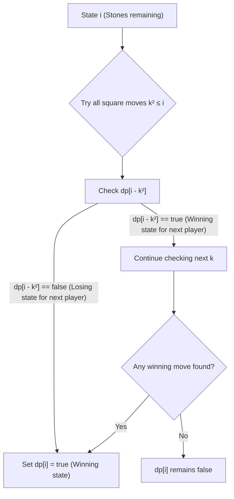

<h2><a href="https://leetcode.com/problems/stone-game-iv">1510. Stone Game IV</a></h2>

<p>Alice and Bob take turns playing a game, with Alice starting first.</p>

<p>Initially, there are <code>n</code> stones in a pile. On each player's turn, that player makes a <em>move</em> consisting of removing <strong>any</strong> non-zero <strong>square number</strong> of stones in the pile.</p>

<p>Also, if a player cannot make a move, he/she loses the game.</p>

<p>Given a positive integer <code>n</code>, return <code>true</code> if and only if Alice wins the game otherwise return <code>false</code>, assuming both players play optimally.</p>

<p>&nbsp;</p>
<p><strong class="example">Example 1:</strong></p>

<pre><strong>Input:</strong> n = 1
<strong>Output:</strong> true
<strong>Explanation: </strong>Alice can remove 1 stone winning the game because Bob doesn't have any moves.</pre>

<p><strong class="example">Example 2:</strong></p>

<pre><strong>Input:</strong> n = 2
<strong>Output:</strong> false
<strong>Explanation: </strong>Alice can only remove 1 stone, after that Bob removes the last one winning the game (2 -&gt; 1 -&gt; 0).
</pre>

<p><strong class="example">Example 3:</strong></p>

<pre><strong>Input:</strong> n = 4
<strong>Output:</strong> true
<strong>Explanation:</strong> n is already a perfect square, Alice can win with one move, removing 4 stones (4 -&gt; 0).
</pre>

<p>&nbsp;</p>
<p><strong>Constraints:</strong></p>

<ul>
	<li><code>1 &lt;= n &lt;= 10<sup>5</sup></code></li>
</ul>


---

# 🛍️ Stone-Game-IV | Explained

## Approach 1: Bottom-Up Dynamic Programming

### Intuition
Think of this game as navigating a directed game state graph where each number from `0` to `n` represents a state (the remaining number of stones). A player wins from a state `i` if they can make a valid move to any state `i - k^2` that is a losing state for the next player. 

Imagine standing at position `i`. If you can jump backward by any square number ($1, 4, 9, 16, \dots$) and land on a spot where the second player is guaranteed to lose, then by taking that optimal move, you guarantee a win for yourself. Conversely, if every valid square jump leads to a position where the next player can win, you are forced into a losing position.

### Algorithm Visualized



### Approach
1. **Define State:** Let `dp[i]` be a boolean value where `true` indicates that the player whose turn it is with `i` stones remaining will win (assuming optimal play), and `false` means they will lose.
2. **Base Case:** `dp[0] = false` because if it is a player's turn and there are 0 stones left, they cannot make a move and lose. (In Java, boolean arrays default to `false`).
3. **State Transitions:** For each number of stones `i` from `1` to `n`:
   - Iterate through all possible square subtractions $k^2 \le i$ ($k = 1, 2, 3, \dots$).
   - If `dp[i - k * k]` is `false`, it means the opponent will lose if we leave them with `i - k * k` stones.
   - Therefore, we can mark `dp[i] = true` and move to evaluating the next state `i + 1`.
4. **Final Result:** Return `dp[n]`.

### Detailed Code Analysis

- **Line 3:** `boolean[] dp=new boolean[n+1];`
  Allocates an array of size $n + 1$ to store game state outcomes from 0 up to $n$. `dp[0]` initializes to `false`, establishing our base case where 0 stones remain.

- **Line 5:** `for(int i=1;i<=n;i++){`
  Iterates iteratively from 1 up to $n$, filling the DP table bottom-up.

- **Line 6:** `for(int k=1;k*k<=i;k++){`
  Checks every valid square number $k^2$ that is less than or equal to $i$. This represents all valid moves Alice/Bob can make on their turn when $i$ stones remain.

- **Lines 7–9:**
  ```java
  if(!dp[i-k*k]){
      dp[i]=true;
  }
  ```
  Evaluates whether removing $k^2$ stones forces the next player into a losing position (`!dp[i - k*k]`). If so, the current position `i` is a winning position (`dp[i] = true`). Note: An early `break` could be added here once `dp[i]` becomes `true` to optimize execution time, though the logical correctness remains unchanged.

- **Line 12:** `return dp[n];`
  Returns the boolean result for $n$ stones, indicating whether the first player (Alice) wins.

### Code
```java
class Solution {
    public boolean winnerSquareGame(int n) {
       boolean[] dp = new boolean[n + 1];

       for (int i = 1; i <= n; i++) {
           for (int k = 1; k * k <= i; k++) {
               if (!dp[i - k * k]) {
                   dp[i] = true;
                   break; // Optimization: Found a winning move, no need to check further k
               }
           }
       }
       return dp[n];
    }
}
```

### Complexity
- **Time Complexity:** $\mathcal{O}(n \sqrt{n})$  
  The outer loop runs $n$ times. The inner loop runs $\sqrt{i}$ times for each $i$. Summing this up across all $i$ yields $\int_{1}^{n} \sqrt{x} \, dx \approx \frac{2}{3} n^{3/2} = \mathcal{O}(n \sqrt{n})$.
- **Space Complexity:** $\mathcal{O}(n)$  
  A 1D boolean array of size $n + 1$ is allocated to store intermediate states.

---

## 🕵️‍♂️ Follow-up Questions (Optional)

1. **How can you optimize the runtime of the inner loop in practice?**
   - **Answer:** Add a `break` statement immediately after setting `dp[i] = true`. Once a single winning transition is found for state `i`, evaluating further values of $k$ is redundant since the state is already determined to be winning.

2. **Can this problem be solved using Top-Down DP (Recursion + Memoization)?**
   - **Answer:** Yes, using an `Integer` array or `Boolean` object memoization table along with standard recursive game-theory min-max logic. However, bottom-up DP is preferred here to avoid stack overflow risks for large values of $n$ ($n \le 10^5$).