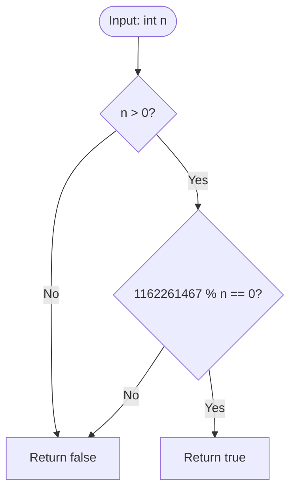

<h2><a href="https://leetcode.com/problems/power-of-three">326. Power of Three</a></h2>

<p>Given an integer <code>n</code>, return <em><code>true</code> if it is a power of three. Otherwise, return <code>false</code></em>.</p>

<p>An integer <code>n</code> is a power of three, if there exists an integer <code>x</code> such that <code>n == 3<sup>x</sup></code>.</p>

<p>&nbsp;</p>
<p><strong class="example">Example 1:</strong></p>

<pre><strong>Input:</strong> n = 27
<strong>Output:</strong> true
<strong>Explanation:</strong> 27 = 3<sup>3</sup>
</pre>

<p><strong class="example">Example 2:</strong></p>

<pre><strong>Input:</strong> n = 0
<strong>Output:</strong> false
<strong>Explanation:</strong> There is no x where 3<sup>x</sup> = 0.
</pre>

<p><strong class="example">Example 3:</strong></p>

<pre><strong>Input:</strong> n = -1
<strong>Output:</strong> false
<strong>Explanation:</strong> There is no x where 3<sup>x</sup> = (-1).
</pre>

<p>&nbsp;</p>
<p><strong>Constraints:</strong></p>

<ul>
	<li><code>-2<sup>31</sup> &lt;= n &lt;= 2<sup>31</sup> - 1</code></li>
</ul>

<p>&nbsp;</p>
<strong>Follow up:</strong> Could you solve it without loops/recursion?

---

# 🛍️ Power-of-Three | Explained

## Approach 1: Mathematical Constant Division (O(1) Constraints)
### Intuition
Think of a prime number $p$ as an exclusive building block. Any number that is a power of $p$ (i.e., $p^k$) has prime factors that consist solely of $p$. Because 3 is a prime number, any power of 3 can only be evenly divided by smaller powers of 3. 

In a standard 32-bit signed integer system, there is a maximum limit to how large a number can be ($2^{31} - 1 = 2,147,483,647$). The largest power of 3 that fits within this 32-bit limit is $3^{19} = 1,162,261,467$. Because 3 is prime, $3^{19}$ contains all smaller powers of 3 ($3^0, 3^1, 3^2, \dots, 3^{19}$) as its only divisors. Therefore, if a given positive integer $n$ divides $3^{19}$ with zero remainder, $n$ must be a power of 3.

### Algorithm Visualized


### Approach
1. **Positivity Check**: Reject any non-positive integers ($n \le 0$) immediately, as powers of 3 are strictly positive ($3^0 = 1, 3^1 = 3, \dots$).
2. **Modulo Division**: Take the maximum 32-bit signed integer power of 3, which is $1,162,261,467$ ($3^{19}$), and perform a modulo operation with $n$.
3. **Evaluate**: If $1162261467 \pmod n == 0$, then $n$ is a valid power of 3.

### Detailed Code Analysis
```java
public class Solution {
    public boolean isPowerOfThree(int n) {
        int maxPowerOf3 = 1162261467; // 3^19 is the largest power of 3 in int range
        return n > 0 && maxPowerOf3 % n == 0;
    }
}
```

- `int maxPowerOf3 = 1162261467;`: Precomputes $3^{19}$. The next power, $3^{20} = 3,486,784,401$, exceeds `Integer.MAX_VALUE` ($2,147,483,647$), causing an integer overflow.
- `n > 0`: Short-circuit evaluation. Prevents negative numbers and zero from proceeding to the modulo check (and avoids a potential `ArithmeticException: / by zero` if $n = 0$).
- `maxPowerOf3 % n == 0`: Evaluates whether $n$ evenly divides $3^{19}$. If true, $n$ must be $3^k$ for some $0 \le k \le 19$.

### Code
```java
public class Solution {
    public boolean isPowerOfThree(int n) {
        int maxPowerOf3 = 1162261467; // 3^19 is the largest power of 3 in int range
        return n > 0 && maxPowerOf3 % n == 0;
    }
}
```

### Complexity
- **Time Complexity:** $\mathcal{O}(1)$ — The operation uses a constant number of arithmetic evaluations (one comparison, one modulo operation, and one logical AND) regardless of the size of $n$.
- **Space Complexity:** $\mathcal{O}(1)$ — Only a single primitive integer constant variable (`maxPowerOf3`) is stored, requiring $\mathcal{O}(1)$ auxiliary memory.

---

## 🕵️‍♂️ Follow-up Questions (Optional)

1. **How would you solve this problem if the language or environment does not restrict integers to 32 bits (e.g., Python or arbitrary-precision arithmetic)?**
   - *Answer:* If bound limits aren't available, you can use loop iteration/recursion dividing $n$ by 3 while $n \% 3 == 0$, or use logarithms with epsilon handling: $\frac{\log_{10}(n)}{\log_{10}(3)} \pmod 1 == 0$. Base-10 logarithms are preferred over natural logarithms to minimize floating-point precision errors.

2. **Why does this math shortcut work for 3, but wouldn't work directly for checking powers of 6?**
   - *Answer:* The shortcut relies on 3 being a **prime number**. The composite number 6 has prime factors 2 and 3. The largest power of 6 in integer range, $6^{11}$, has divisors like 2, 4, 12, etc., which are not powers of 6. Thus, $6^{11} \pmod n == 0$ would yield false positives for numbers like $n = 2$ or $n = 12$.