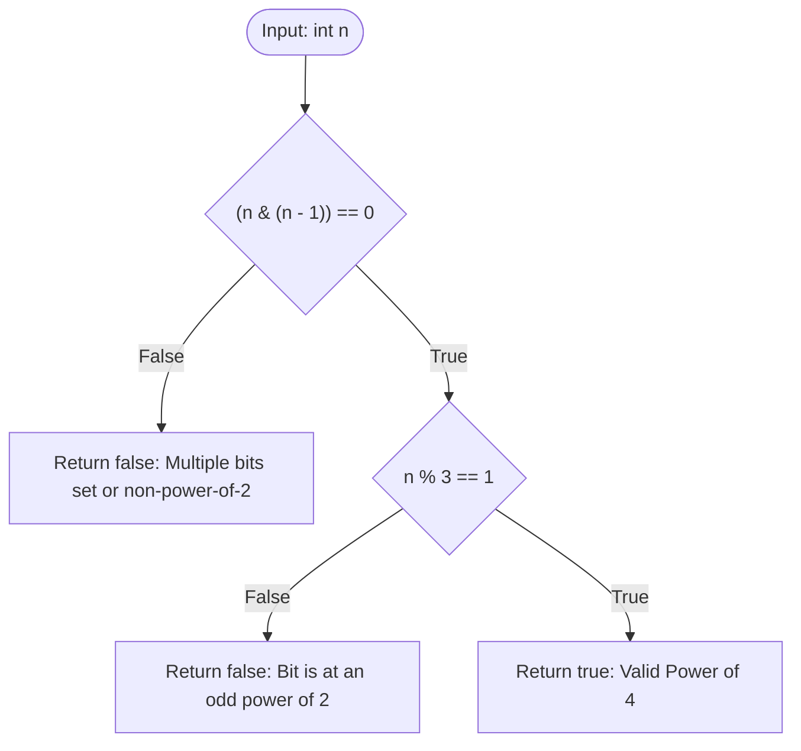

<h2><a href="https://leetcode.com/problems/power-of-four">342. Power of Four</a></h2>

<p>Given an integer <code>n</code>, return <em><code>true</code> if it is a power of four. Otherwise, return <code>false</code></em>.</p>

<p>An integer <code>n</code> is a power of four, if there exists an integer <code>x</code> such that <code>n == 4<sup>x</sup></code>.</p>

<p>&nbsp;</p>
<p><strong class="example">Example 1:</strong></p>
<pre><strong>Input:</strong> n = 16
<strong>Output:</strong> true
</pre><p><strong class="example">Example 2:</strong></p>
<pre><strong>Input:</strong> n = 5
<strong>Output:</strong> false
</pre><p><strong class="example">Example 3:</strong></p>
<pre><strong>Input:</strong> n = 1
<strong>Output:</strong> true
</pre>
<p>&nbsp;</p>
<p><strong>Constraints:</strong></p>

<ul>
	<li><code>-2<sup>31</sup> &lt;= n &lt;= 2<sup>31</sup> - 1</code></li>
</ul>

<p>&nbsp;</p>
<strong>Follow up:</strong> Could you solve it without loops/recursion?

---

# 🛍️ Power-of-Four | Explained

## Approach 1: Bit Manipulation with Modulo Arithmetic

### Intuition
Think of determining whether a number is a power of four as passing through a two-stage Security Checkpoint:

1. **Gate 1 (Power of Two Check):** Is the number a power of 2? A number that is a power of 2 has exactly one binary digit set to `1` (e.g., $1_2, 10_2, 100_2, 1000_2$). 
2. **Gate 2 (Position Check):** Is that single set bit sitting on an *even* 0-indexed position ($2^0=1$, $2^2=4$, $2^4=16$, $2^6=64$)? 

Instead of iterating through bit shifts or using logarithmic functions, we leverage two mathematical properties:
- **Bit Clearing Trick:** `n & (n - 1)` clears the lowest set bit of $n$. If $n$ has only one bit set, clearing it leaves $0$.
- **Algebraic Congruence:** By the Binomial Theorem, any power of four can be expressed as $4^k = (3 + 1)^k \equiv 1^k \equiv 1 \pmod 3$. Conversely, powers of two that are **not** powers of four equal $2 \cdot 4^k = 2(3 + 1)^k \equiv 2 \pmod 3$. Thus, any power of two that leaves a remainder of $1$ when divided by $3$ MUST be a power of four.

### Algorithm Visualized



### Approach
1. Perform a bitwise AND between $n$ and $n - 1$. If $n$ is a power of two (or edge cases like $0$ or `Integer.MIN_VALUE`), `(n & (n - 1))` evaluates to `0`.
2. Evaluate the remainder of $n$ when divided by $3$ (`n % 3`). If $n$ is a power of four, this remainder is guaranteed to be $1$.
3. Combine both checks using the logical short-circuit AND operator (`&&`). If either condition fails, the function immediately returns `false`.

### Detailed Code Analysis

```java
1class Solution {
2    public boolean isPowerOfFour(int n) {
3        return (n & (n - 1)) == 0 && n % 3 == 1;
4    }
5}
```

- **Line 3 (`(n & (n - 1)) == 0`):**
  - **Operator Precedence:** Parentheses around `n & (n - 1)` are critical because equality `==` has higher operator precedence than bitwise AND `&`.
  - **Mechanism:** Subtracting $1$ from $n$ flips all trailing zeroes up to and including the rightmost set bit (`1`). Bitwise ANDing $n$ with $(n - 1)$ zeroes out that lowest set bit.
  - **Behavior on Edge Cases:**
    - If $n = 0$: $0 \ \& \ -1 = 0$, evaluating `(0 & -1) == 0` as `true`.
    - If $n = -2147483648$ (`Integer.MIN_VALUE` / `0x80000000`): $n - 1$ overflows to `2147483647` (`0x7FFFFFFF`). `0x80000000 & 0x7FFFFFFF` equals `0`, evaluating to `true`.

- **Line 3 (`&& n % 3 == 1`):**
  - **Short-Circuit Evaluation:** If `(n & (n - 1)) == 0` is `false`, Java immediately returns `false` without executing `n % 3`.
  - **Filtering Non-Positives & Odd Powers:**
    - For $n = 0$: $0 \pmod 3 = 0 \neq 1 \implies \text{false}$.
    - For $n = \text{Integer.MIN_VALUE}$: $-2147483648 \pmod 3 = -2 \neq 1 \implies \text{false}$.
    - For $n = 2$ ($2^1$): $2 \pmod 3 = 2 \neq 1 \implies \text{false}$.
    - For $n = 4$ ($4^1$): $4 \pmod 3 = 1 == 1 \implies \text{true}$.
    - For $n = 16$ ($4^2$): $16 \pmod 3 = 1 == 1 \implies \text{true}$.

### Code
```java
class Solution {
    public boolean isPowerOfFour(int n) {
        return (n & (n - 1)) == 0 && n % 3 == 1;
    }
}
```

### Complexity
- **Time Complexity:** $\mathcal{O}(1)$ — The expression consists of a fixed set of primitive hardware operations (bitwise AND, subtraction, equality, modulo) executing in constant time.
- **Space Complexity:** $\mathcal{O}(1)$ — No additional data structures or variable allocations are used; execution occurs entirely within CPU registers.

---

## 🕵️‍♂️ Follow-up Questions

### 1. How would you solve this without using the modulo `%` operator?
**Answer:** You can use a bitmask filtering approach. Because $n$ must be positive and have its set bit at an even position (bit 0, 2, 4, ..., 30), we can perform a bitwise AND with the hexadecimal mask `0x55555555` (which is `0b01010101010101010101010101010101` in binary):

```java
public boolean isPowerOfFour(int n) {
    return n > 0 && (n & (n - 1)) == 0 && (n & 0x55555555) != 0;
}
```

### 2. Why does `(n & (n - 1)) == 0` evaluate to `true` for `Integer.MIN_VALUE`?
**Answer:** In 32-bit signed two's complement representation, `Integer.MIN_VALUE` is represented as `10000000 00000000 00000000 00000000` (only the sign bit is set). Subtracting $1$ causes an integer underflow to `Integer.MAX_VALUE`, represented as `01111111 11111111 11111111 11111111`. Bitwise ANDing these two complementary bit patterns yields `0`, making the first condition `true`. The second check (`n % 3 == 1`) correctly handles this edge case by evaluating $-2147483648 \pmod 3 = -2 \neq 1$.